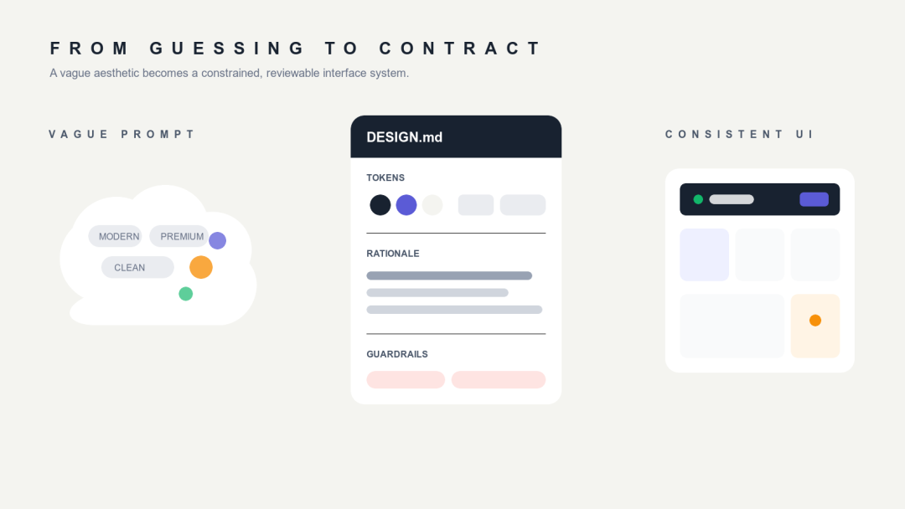
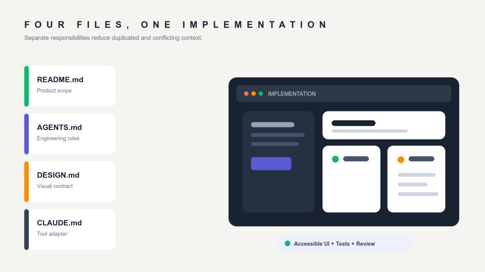
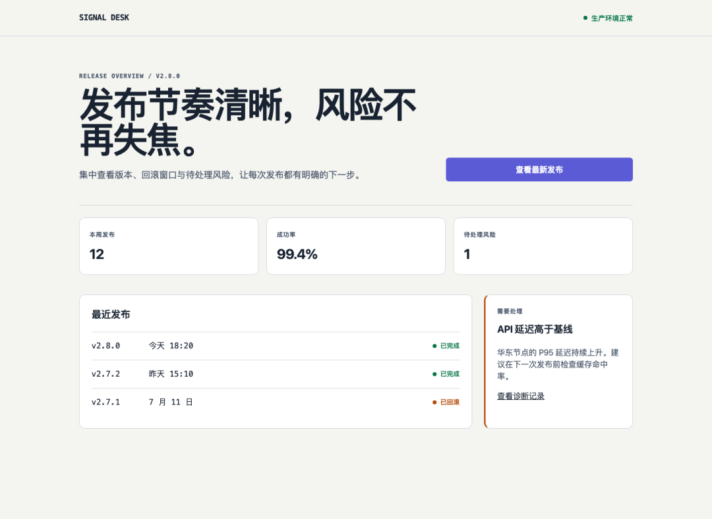
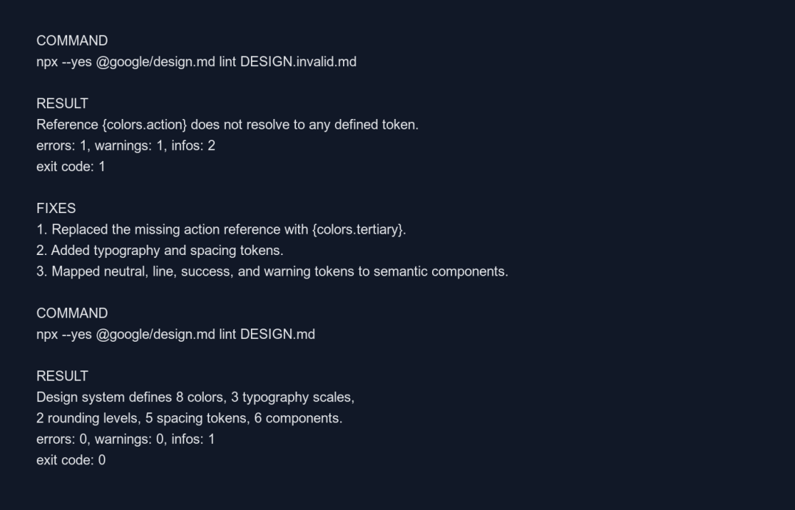

# DESIGN.md：把 AI 生成 UI 从凭感觉变成可验证工程

**作者**: 沐风
**发布时间**: 2026-07-14 22:39
**原文链接**: https://mp.weixin.qq.com/s/e4OwQ__yjcV4qRy1pycsXA

---


让 AI 写一个能运行的页面，今天已经不难。

难的是让它连续写五个页面，仍然像同一个产品；换一次会话、换一个 Agent、改一轮需求之后，颜色、圆角、层级、留白和交互状态仍然不漂移。

很多团队的做法，是在 Prompt 里反复补形容词：
```

做得现代一点、简洁一点、高级一点，像一线 SaaS 产品。
```

这类描述的问题不是不够长，而是不够具体。Google 的 `DESIGN.md` 哲学文档直接指出，类似 “modern、clean、trustworthy、premium” 的词只描述了一个模糊区域，模型最后往往会落到这个区域的平均值，于是生成一个似曾相识的通用界面。

`DESIGN.md` 解决的，正是这种“让模型自己补全设计”的问题。



## DESIGN.md 到底是什么

按 Google Labs 当前公开规范，`DESIGN.md` 是一种面向 Coding Agent 的视觉身份描述格式。一个文件包含两层内容：

  1. 1\. YAML Front Matter：机器可读的颜色、字体、间距、圆角和组件 Token。
  2. 2\. Markdown 正文：人和模型都能理解的设计意图、使用理由、组件语义以及 Do's and Don'ts。

最小结构大致如下：
```

---  
version: alpha  
name: Signal Desk  
colors:  
  primary: "#182230"  
  tertiary: "#5B5BD6"  
  surface: "#FFFFFF"  
rounded:  
  sm: 6px  
components:  
  button-primary:  
    backgroundColor: "{colors.tertiary}"  
    textColor: "{colors.surface}"  
    rounded: "{rounded.sm}"  
---  
  
## Overview  
  
像一本运维记录册与安静的航空仪表盘：紧凑、克制、事实优先。  
它不是一个用渐变和悬浮卡片制造氛围的营销后台。  
  
## Do&#x27;s and Don&#x27;ts  
  
- Do 让发布状态先于次要指标被看见。  
- Don&#x27;t 使用玻璃模糊、发光描边和装饰性图表。
```

这里有一个容易被误读的细节：Token 与文字不是二选一。

Token 负责消除数值歧义。例如，主按钮到底是哪个紫色、圆角是 6px 还是 12px。文字负责解释为什么这样设计、什么场景可以偏离、什么东西绝对不该出现。Google 的规范 README 强调 Token 提供精确值，正文提供应用上下文；它的哲学文档进一步强调，设计质量更取决于意图是否描述清楚。

工程上可以把它理解为：
```

Token 决定“用什么”  
设计理由决定“为什么这样用”  
负面约束决定“不能变成什么”
```

只有 Token，AI 容易把设计系统当调色板。只有散文，AI 又会在精确数值上自行发挥。两者同时存在，才构成完整视觉契约。

## 为什么喂给 AI 之后，效果通常会更好

先说明边界：下面是基于规范与本次实战得到的工程解释，不是模型厂商发布的量化 Benchmark。`DESIGN.md` 不能保证任何模型一定产出好设计，但它能系统性减少四类常见猜测。

### 第一层：减少隐式自由度

当你只说“做一个现代后台”，模型必须自己决定字体、字号、颜色、卡片密度、阴影、圆角、动效和响应式行为。每一个空白都是一次随机选择。

`DESIGN.md` 把这些自由度显式化。AI 不再从互联网平均风格里抽样，而是在一个更窄、更明确的设计空间内工作。

### 第二层：把审美偏好变成语义规则

颜色值本身没有业务含义。`#5B5BD6` 只有在“仅用于一个主操作和当前选择”这句话出现之后，才成为约束。

同样，“不要给每个指标都做一张悬浮卡片”比“少用卡片”更可执行；“状态不能只靠颜色表达，必须同时有文字”比“注意可访问性”更容易验证。

### 第三层：跨会话保持稳定上下文

Prompt 是一次性的，项目文件是持久的。把设计规则放进仓库，意味着下一次会话、另一个 Agent、一次 Code Review，都能看到同一份视觉事实来源。

它还天然获得了 Git 的能力：可审查、可对比、可回滚。Google 官方 CLI 目前提供 `lint`、`diff` 与多种 Token 导出能力，设计变更因此不必只靠肉眼回忆。

### 第四层：让设计问题进入验证闭环

一句“颜色好像不统一”很难进入 CI；一个无法解析的 `{colors.action}` 引用可以。

当视觉规则变成结构化文件，团队就能在生成代码之前发现断裂引用、低对比度、章节顺序和缺失字体等问题。AI UI 开发第一次有机会从“生成后再凭感觉返工”，变成“实现前先检查契约”。

## 四个文件如何分工

推荐的项目根目录不是简单堆四份说明书，而是让它们分别回答四种问题：
```

project/  
├── README.md  
├── AGENTS.md  
├── DESIGN.md  
├── CLAUDE.md  
└── src/
```

| 文件          | 回答的问题            | 适合写什么                    | 不该写什么                  |
|-------------|------------------|--------------------------|------------------------|
| `README.md` | 这是什么产品           | 用户、目标、范围、运行方式、验收标准       | 细碎的 Agent 行为偏好         |
| `AGENTS.md` | 代码应该怎么改          | 架构、命令、测试、变更边界、安全规则       | 逐页视觉细节                 |
| `DESIGN.md` | 产品应该长什么样         | Token、设计理由、组件语义、响应式、禁用模式 | 业务需求与构建命令              |
| `CLAUDE.md` | Claude Code 如何接入 | 导入共享规则、Claude 专属流程与注意事项  | 与 `AGENTS.md` 重复且冲突的规则 |



这里必须纠正一个常见前提：Claude Code 官方文档明确写着，它读取的是 `CLAUDE.md`，不是 `AGENTS.md`。如果项目已经使用 `AGENTS.md`，官方建议在 `CLAUDE.md` 中导入它：
```

@AGENTS.md  
  
## Claude Code  
  
- 修改 UI 前先总结 README.md 与 DESIGN.md 中的约束。  
- 不要用通用的“modern SaaS”风格覆盖具体设计规则。
```

Codex 则会在开始工作前发现并读取 `AGENTS.md`，并按目录层级合并更具体的规则。

所以，`CLAUDE.md` 最适合做适配层，而不是复制一遍 `AGENTS.md`。复制会产生两个事实来源；一旦其中一份更新、另一份忘了改，模型会面对互相冲突的上下文。

## 实战：为发布状态网站建立视觉契约

为了验证这套方法，我在一个空目录里实际做了一个名为 Signal Desk 的静态发布状态网站。它没有使用 React、Tailwind 或组件库，只有原生 HTML 与 CSS。这样可以把变量控制在设计上下文本身，而不是把框架能力误认为 `DESIGN.md` 的效果。

### 第一步：先写产品边界，不急着写页面

`README.md` 只定义产品问题和验收标准：
```

# Signal Desk  
  
为独立开发者提供一页式发布状态面板，让用户在十秒内看清：  
当前版本、待处理风险、最近发布与下一步操作。  
  
## 验收标准  
  
- 仅使用原生 HTML 与 CSS，不加载第三方资源  
- 适配 375px 手机和 1440px 桌面宽度  
- 键盘可访问，所有交互元素有清晰焦点态  
- 页面信息层级遵循根目录 DESIGN.md
```

这一步非常重要。没有产品范围，设计文件越详细，AI 也可能越认真地做错产品。

### 第二步：在 AGENTS.md 里定义工程约束
```

## Implementation  
  
- Use semantic HTML before ARIA attributes.  
- Keep CSS tokens in `:root`; token names must map to `DESIGN.md`.  
- Support 375px and 1440px viewports without horizontal scrolling.  
- Preserve visible `:focus-visible` states and reduced-motion behavior.  
  
## Verification  
  
- Run `npx @google/design.md lint DESIGN.md` after editing the design contract.  
- Verify the primary action, warning state, and status labels do not rely on color alone.
```

注意它没有规定背景必须是什么颜色。那是 `DESIGN.md` 的职责。`AGENTS.md` 只规定实现和验证方式。

### 第三步：给设计一个具体世界，而不是一串形容词

Signal Desk 的 `Overview` 没写“现代、专业、高级”，而是写：
```

Signal Desk should feel like an operations notebook crossed with a quiet  
avionics panel: compact, factual, calm under pressure.  
It is not a glossy marketing dashboard.
```

这个参考点自然导出一组选择：温暖的浅色纸面、深色墨水、稀少的状态色、紧凑的信息密度、克制圆角、无玻璃模糊、无装饰图表。

这正是 Google 哲学文档强调的原则：一个具体参考点，比十几个宽泛形容词承载更多设计信息。

### 第四步：实现页面，并检查可见结果

最终页面把主状态放在第一视觉层，只保留一个首屏主按钮；版本与时间使用等宽字体；成功和回滚状态同时使用圆点与文字；卡片主要靠边框和明度分层，没有渐变、玻璃和发光。



这张图是本次在本地真实实现并用浏览器截取的页面，不是生成式模型伪造的产品截图。它不能证明 `DESIGN.md` 一定优于所有 Prompt，只能证明这套四文件约束可以落到一个可运行、可检查的结果上。

## 一次真实失败：Token 写了，不代表契约有效

第一次验证时，我故意保留了一个不存在的组件引用：
```

components:  
  button-primary:  
    backgroundColor: "{colors.action}"
```

颜色表里并没有 `colors.action`。运行官方 linter：
```

npx --yes @google/design.md lint DESIGN.invalid.md
```

得到真实错误：
```

Reference {colors.action} does not resolve to any defined token.  
errors: 1, warnings: 1, infos: 2  
exit code: 1
```

修复断裂引用之后，第二次检查仍然出现 4 个警告：`neutral`、`line`、`success`、`warning` 已定义，却没有被任何组件引用。

这暴露了一个常见误区：设计 Token 不是越多越好。没有映射到实际语义的 Token，只是一份库存清单。

我继续补上 `page`、`divider`、`status-success`、`status-warning` 的组件映射，最终结果为：
```

errors: 0, warnings: 0, infos: 1  
exit code: 0
```



这次失败带来的教训很具体：

  1. 1\. `DESIGN.md` 需要和真实组件共同演进，不能脱离代码独立扩张。
  2. 2\. 先写少量高价值 Token，再让组件引用它们，比一开始复制几百个变量更可靠。
  3. 3\. `lint` 通过只说明结构没有明显问题，不代表界面一定好看；视觉审查、响应式检查和可访问性测试仍然不可替代。

## 从社区 DESIGN.md 借鉴时，别直接复制品牌

`awesome-design-md` 提供了大量从公开网站整理的设计语言案例，适合研究一个完整 `DESIGN.md` 会写到什么深度。它也明确声明：这些文件是从公开网站提取的整理结果，按原样提供，不主张拥有对应网站的视觉身份。

因此，更稳妥的使用方式不是“复制 Vercel，然后做一个像 Vercel 的产品”，而是拆解它的决策：

  * • 为什么主次操作能只用很少的颜色区分。
  * • 为什么 Geist 的字号、字重和字距形成清晰层级。
  * • 为什么组件状态、响应式和可访问性规则必须同时存在。
  * • 哪些规则属于特定品牌，哪些原则可以迁移到自己的产品。

Vercel 公开的 `/design.md` 本身是一个很好的大型案例。它包含浅色 Geist 系统的颜色梯度、字体层级、圆角、间距与组件 Token，并声明暗色版本位于 `/design.dark.md`。但它不是可以无脑搬运的通用模板。Vercel 的 Web Interface Guidelines 也明确区分了框架无关建议和 Vercel 自身品牌偏好。

正确动作是“研究约束如何表达”，不是“复制别人的视觉身份”。

## 推荐的落地流程

如果准备在真实 App 或网站中引入 `DESIGN.md`，建议按下面顺序开始：

### 1\. 先选一个页面，不要全量改造

从登录、设置、Dashboard 或详情页中选一个边界清楚的页面。用它验证规则是否足够具体，再扩展到整个产品。

### 2\. 从现有产品提取事实

记录正在使用的颜色、字体、间距、圆角和核心组件状态。不要凭记忆新造一套“更完整”的系统。

### 3\. 先写 Overview 与 Don'ts

用一个具体参照描述产品气质，然后列出最容易被 AI 带偏的 5 到 10 条禁用模式。对生成质量而言，这通常比立刻补齐几百个 Token 更有价值。

### 4\. 再补最小 Token 与组件映射

只加入首个页面确实会使用的 Token，并确保它们能映射到真实组件。保持命名有语义，例如 `status-warning`，不要只写 `orange-500`。

### 5\. 把验证命令写进 AGENTS.md

让 Agent 知道什么时候运行 `lint`，需要检查哪些视口、哪些交互状态、哪些可访问性要求。约束只有进入工作流，才不会停留在文档里。

### 6\. 保持 CLAUDE.md 很薄

如果团队同时使用 Codex 与 Claude Code，让 `CLAUDE.md` 导入 `AGENTS.md`，只保留 Claude 特有规则。不要维护两套重复的项目事实。

### 7\. 用 diff 审查设计变更

当颜色、圆角或组件语义发生变化时，先运行：
```

npx @google/design.md diff DESIGN.md DESIGN-v2.md
```

再决定是否接受变化。设计系统的修改应该像 API 变更一样被审查，而不是在一次生成中悄悄发生。

## DESIGN.md 不能解决什么

最后必须给它降降温。

`DESIGN.md` 不是 Figma 替代品，不会自动补齐用户研究、信息架构、内容策略和交互原型；它也不是强制执行层。Anthropic 官方文档明确说明，`CLAUDE.md` 属于上下文，不是强制配置。相同道理也适用于任何交给模型阅读的说明文件：规则越具体、越简洁、冲突越少，遵循概率通常越高，但不能把“模型看到了”误认为“模型一定执行”。

它最适合解决的是：

  * • 让 AI 少猜视觉决策。
  * • 让不同页面和会话共享同一设计语言。
  * • 让设计意图进入版本控制与审查。
  * • 让一部分视觉错误在生成代码前就被工具发现。

如果产品本身没有明确目标，设计决策互相冲突，或者团队从不验证输出，再完整的 `DESIGN.md` 也只是一份不会自动生效的文档。

## 总结

把 `DESIGN.md` 喂给 AI，真正提升的不是模型的审美上限，而是项目对模型的约束质量。

`README.md` 说明做什么，`AGENTS.md` 说明怎么做，`DESIGN.md` 说明做成什么样，`CLAUDE.md` 负责让 Claude Code 正确接入共享规则。四份文件共同把一次性的 Prompt，变成可持续维护的项目上下文。

最值得复制的不是某个大厂的颜色表，而是这种工作方式：把隐含决策写出来，把模糊形容词换成具体参考，把 Token 映射到组件，把设计文件放进 lint、diff、截图和人工审查的闭环。

这样，AI 开发才不只是“这次生成得不错”，而是下一次仍有较高概率做对。

## 参考资料

  * • Google Labs：DESIGN.md 规范与 CLI[1]  

  * • Google Labs：DESIGN.md Philosophy[2]  

  * • Vercel：Geist DESIGN.md[3]  

  * • Vercel：Web Interface Guidelines[4]  

  * • OpenAI：Custom instructions with AGENTS.md[5]  

  * • Anthropic：How Claude remembers your project[6]  

  * • VoltAgent：awesome-design-md[7]  

如果你已经在项目里使用 `DESIGN.md`，欢迎在评论区分享：哪一条设计规则最能减少 AI 的误判，哪一类约束仍然经常失效。真实案例会帮助更多国内开发者少走弯路。

如果这篇文章对你有用，欢迎点一下 `在看`，或转发给正在用 AI 开发 App 和网站的朋友。

写 AI，写成长，偶尔写投资。  
关注沐风，不定期更新，全是干货。

2026.07.14 22:16  
沪 · 赵巷

📌 声明：本文由 AI 辅助完成

#### 引用链接

`[1]` Google Labs：DESIGN.md 规范与 CLI:  _https://github.com/google-labs-code/design.md_  
`[2]` Google Labs：DESIGN.md Philosophy:  _https://github.com/google-labs-code/design.md/blob/main/PHILOSOPHY.md_  
`[3]` Vercel：Geist DESIGN.md:  _https://vercel.com/design.md_  
`[4]` Vercel：Web Interface Guidelines:  _https://vercel.com/design/guidelines_  
`[5]` OpenAI：Custom instructions with AGENTS.md:  _https://developers.openai.com/codex/guides/agents-md_  
`[6]` Anthropic：How Claude remembers your project:  _https://code.claude.com/docs/en/memory_  
`[7]` VoltAgent：awesome-design-md:  _https://github.com/voltagent/awesome-design-md_  


