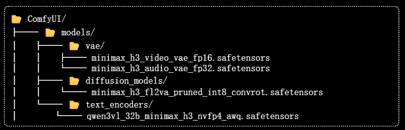
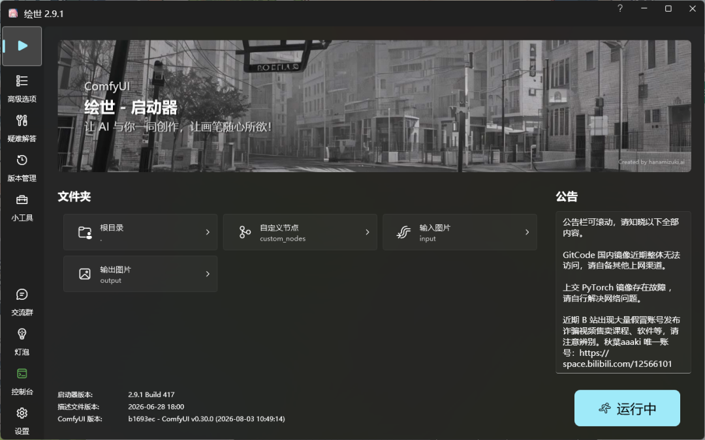
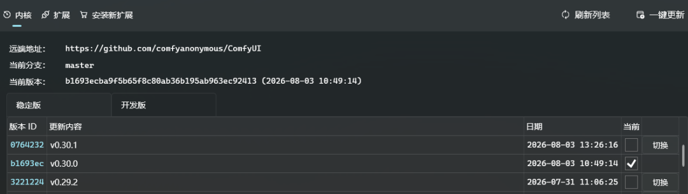
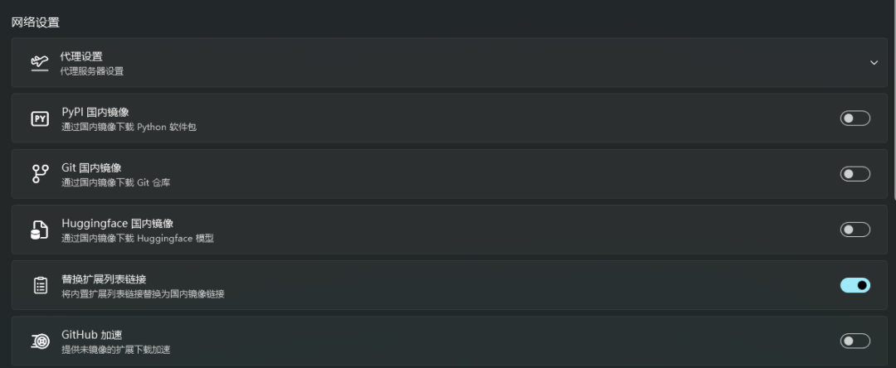
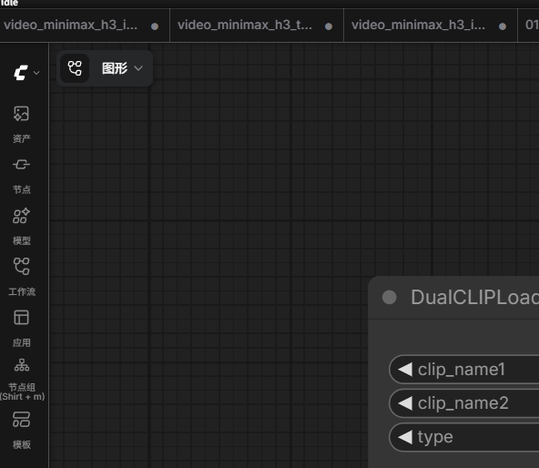
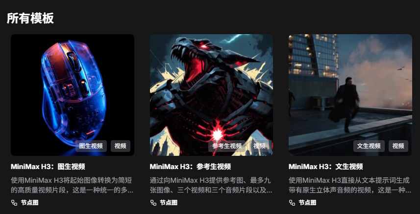
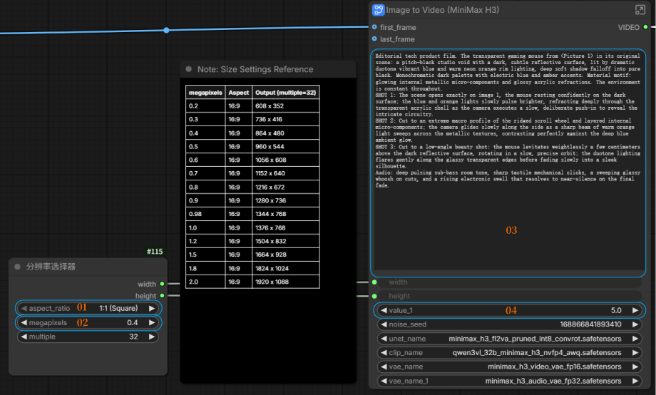
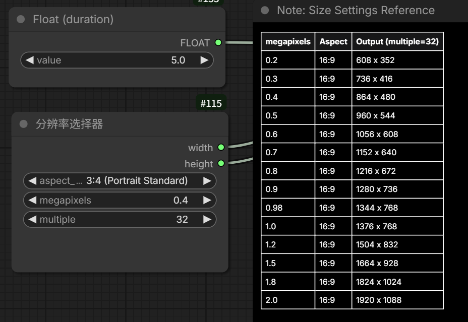
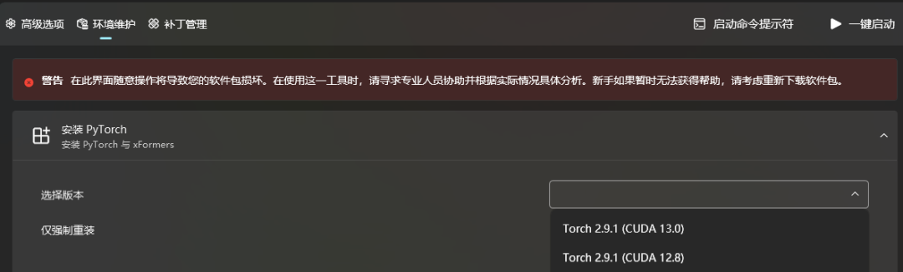

# MiniMax H3 本地部署保姆级教程:8G 显存就能跑的开源视频模型

**作者**: 数字Q
**发布时间**: 2026-08-05 17:33
**原文链接**: https://mp.weixin.qq.com/s/w5eU5rdBZS6YoH2ZbOR1Lw

---

2026 年 8 月 3 日,MiniMax 把 H3 开源了。这是个能同时生成**视频和音频**的开源模型,而且原生支持 ComfyUI,不用搭一堆乱七八糟的环境。

我花了一天把它跑通,顺便把整个过程记下来。这篇是保姆级教程,跟着走就行,每一步都带截图。

先说个好消息：门槛低，效果好，开源王炸。

01

PART

硬件要求

SPEC · 最低 8G 显存

这是我觉得最该先讲的部分。很多人一听“视频生成模型”就觉得得 4090 才能碰，这次真不用。

最低配置

显卡 

8G 显存（2060 / 3060 / 4060 这个级别都能跑）

内存 

32G

我自己的配置（供参考）

RTX 4090 D · 24G内存 128G

显存小的话，把分辨率和生成时长调低就行（下面会讲具体调法）。8G 显存能跑，只是慢一点、画面小一点，不是跑不动。

02

PART

先认识一下要下的东西

MODEL · 四个文件 39G

整套模型加起来 39G，四个文件：

1 · 扩散模型 · 19.5G 

minimax_h3_fl2va_pruned_int8_convrot.safetensors 放 models/diffusion_models/

2 · 文本编码器 · 14.6G 

qwen3vl_32b_minimax_h3_nvfp4_awq.safetensors 放 models/text_encoders/

3 · 视频 VAE · 4.84G 

minimax_h3_video_vae_fp16.safetensors 放 models/vae/

4 · 音频 VAE · 577M 

minimax_h3_audio_vae_fp32.safetensors 放 models/vae/

记得 diffusion_models、text_encoders、vae 是三个不同的文件夹，别放错了。

四个文件归位后的样子，三个文件夹分开

03

PART

第一步：装 ComfyUI

INSTALL · 任选其一

A官方桌面版（推荐新手）

官网 comfy.org，点“下载桌面版”，一路下一步。永久免费、开源。

B秋叶整合包（本文以此为例）

国内用户用这个更顺手，自带启动器和各种工具。下面我以**秋叶整合包** 演示。官方桌面版的操作逻辑一样，只是没有启动器那些高级功能。

04

PART

第二步：升级内核到 0.30.0 以上

KERNEL · 这一步是关键

这一步是关键。MiniMax H3 只在 ComfyUI 内核 0.30.0 及以上版本才有原生支持，旧版本根本看不到 H3 的工作流模板。在秋叶启动器里打开「版本管理」：

当前版本如果还是 0.2x，就要升。最新是 v0.30.1

**坑点：刷新不出新版本？关掉镜像。** 如果你点「刷新列表」看不到 0.30.0 以上的版本，是国内镜像还没同步。去启动器的设置里，把所有镜像和加速开关暂时关掉：

五个开关全关，开着代理或镜像反而刷不到最新的内核

关完再回去刷新，就能看到 0.30.1 了，点「切换」升级。升完内核，这些镜像开关可以再开回来，平时下别的模型还得靠它们。

05

PART

第三步：加载 H3 官方工作流模板

TEMPLATE · 左侧菜单栏

内核升到 0.30.0 以上后，运行 ComfyUI。看界面左侧菜单栏，点「模板」图标：

里面已经有 MiniMax 官方准备好的三个模板：

图生视频 

给一张起始图，生成视频

参考生视频 

给参考图，最多 9 张图 + 3 段视频 + 3 段音频

文生视频 

纯文字生成视频

随便选一个点开。第一次打开，ComfyUI 会提示你缺少模型文件，并给出下载按钮。点下载，能下动最好。下不动的话，用我分享的网盘链接（我评论区发一下），下完按上面那张表格放到对应文件夹。

06

PART

第四步：工作流只要改 4 个地方

CONFIG · 比例 / 像素 / 提示词 / 秒数

模板加载好，模型放到位，接下来看工作流。看着一堆节点吓人，其实你只要动 4 个参数：

1 · 比例 

画面的宽高比，横屏竖屏自己选

2 · 像素 

分辨率。强烈建议选 0.4，也就是 480p。显存大的可以调高，8G 显存老老实实 480p

3 · 提示词 

你想生成什么，用文字描述

4 · 生成秒数 

视频长度。这个有个参考表：

按你的显存选合适的分辨率和时长组合，别贪

四个参数填好，**点运行** 。

07

PART

跑起来了

RESULT · 实测数据

正常情况，这就出片了。我实测跑通后：

实测数据

GPU 93%显存稳定 19G温度 79°C约 2 分钟一条

显存小的话会慢一些，但只要参数没贪、不爆显存，都能出。

08

PART

万一显存炸了：排查清单

DEBUG · 环境版本对不上

如果你跑到最后报错了、显存炸了，不是工作流的问题，是环境版本对不上。按这个顺序查：

Step 1核对 torch 和 CUDA 版本

这是最常见的坑。MiniMax H3 依赖 ComfyUI 0.30 的 DynamicVRAM（动态显存管理，显存放不下时自动卸载到内存），而 DynamicVRAM 要 PyTorch 2.8 以上才真正生效。秋叶整合包默认带的是 torch 2.5.1+cu124，版本太旧，DynamicVRAM 被禁用，显存该炸还是炸。升级方法（秋叶启动器里点「高级选项」→「安装 PyTorch」）：

选 Torch 2.9.1 (CUDA 12.8)，点安装

官方桌面版用户用命令行：

...bash

python -m pip install torch==2.9.1 torchvision==0.24.1

\--index-url https://download.pytorch.org/whl/cu128

Step 2torchaudio 别忘了

很多人只升 torch，忘了 torchaudio。它残留旧版会和新 torch 的 CUDA 版本冲突，启动直接崩。三个一起升，版本号对齐：

...bash

python -m pip install torchaudio==2.9.1

\--index-url https://download.pytorch.org/whl/cu128

秋叶启动器用户不用手动敲，「安装 PyTorch」工具会连带处理。

Step 3自定义节点冲突

如果升完 torch 启动还是崩，八成是某个自定义节点在捣乱。我遇到的是 ComfyUI-nunchaku，它跟 H3 的工作流冲突。最简单的办法：去 custom_nodes/ 文件夹，把它的目录名改成 .disabled 后缀，重启就好了。排查思路就是，把自定义节点逐个禁用，看哪个是凶手。

09

PART

关于硬件的几句话

EPILOGUE · 碎碎念

开源视频模型已经跨过了“只有顶配能玩”的门槛。8G 显存的卡，在一年前你都不敢想跑视频模型，现在调低参数就能出片。

当然，显存越大越舒服。24G 的卡我能跑到 19G 显存占用、480p 两分钟出一条；8G 的卡可能要降到更低的分辨率、更短的时长，但能跑和不能跑是质变，慢一点是量变。如果你的硬件够**8G 显存 + 32G 内存** ，先跑起来再说。

一些碎碎念：这个时代真的是最好的时代，当初我玩 comfyui 的时候各种找插件排查 bug，一弄就是一两天，工作流都要自己搭或者找大佬的，现在厂商和平台直接就把所有的插件工作流做好，端出来了。爽爽用起来就行了。开源万岁！

  

我的一些测试案例[实测MinimaxH3本地部署,绝对开源第一](https://mp.weixin.qq.com/s?__biz=MzY4MjI2NTQ2OQ==&mid=2247485379&idx=1&sn=c84607a4ed522602fd6e852a5e687ad3&scene=21#wechat_redirect)

