# Vite+ DevTools 发布！功能太强大了！

**作者**: 前端开发爱好者
**发布时间**: 2026-08-05 08:33
**原文链接**: https://mp.weixin.qq.com/s/vO_8cD2662Y0HYPVKVgQhA

---

**Vite** 又放大招了。

最近，**Vite** 官方推出了 **Vite+ DevTools** ！


并且后续版本将集成更多核心工具：

  * `Vite+ DevTools`
  * `Rolldown DevTools`
  * `Vitest DevTools`
  * `Oxc DevTools`

这意味着以后开发者可以在一个统一面板里：

`查看模块依赖`、`分析构建过程`、`调试插件`、`管理测试`、`检查代码质量`。

**Vite** 正在从一个构建工具，逐渐变成完整的前端工程平台。

## Vite+ DevTools 到底是什么？

以前调试前端项目，基本都是多个工具组合。

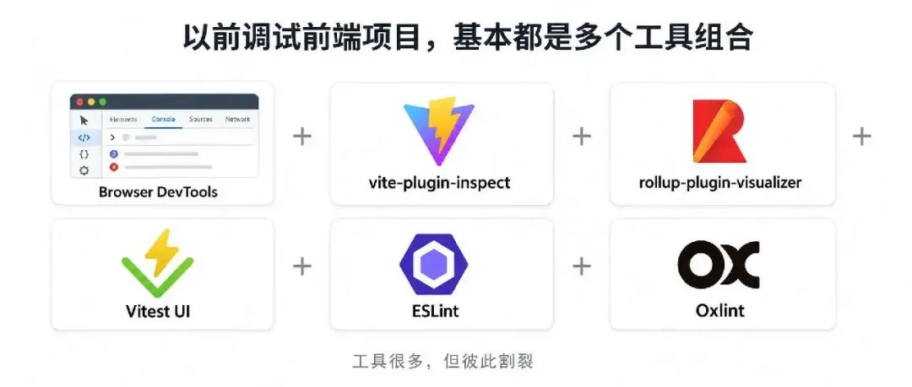

开发阶段：

  * 浏览器 `DevTools` 查看运行状态
  * `vite-plugin-inspect` 分析插件
  * `rollup-plugin-visualizer` 分析 bundle
  * `Vitest UI` 查看测试
  * `ESLint/Oxlint` 单独执行检查

每个工具能力都很强，但彼此之间是割裂的。

Vite+ DevTools 想解决的问题就是：

**把整个前端工程生命周期放进一个统一控制台。**

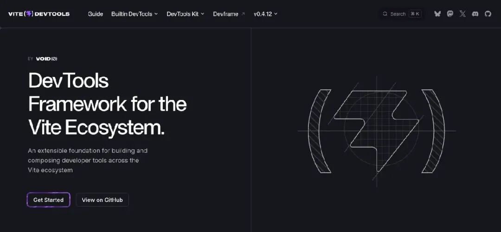

打开之后，可以直接查看：

  * 当前项目环境
  * Vite 插件列表
  * Module Graph
  * 模块依赖关系
  * 构建 Session
  * 测试状态
  * Oxc 配置

# 如何使用 Vite+ DevTools？

目前 `Vite+ DevTools` 处于 Preview 阶段，需要基于 `Vite 8+` 使用。

首先安装：
```

pnpm add -D @vitejs/devtools  

```

然后根据使用场景选择运行方式。

## 方式一：Standalone Mode（独立窗口）

这种方式最适合日常开发调试。

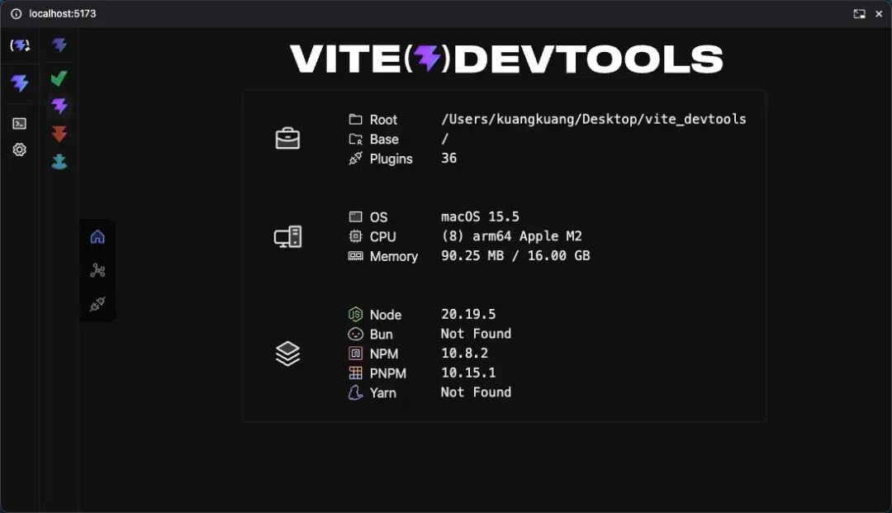

修改 `vite.config.ts`：
```

import { defineConfig } from 'vite'  
  
export default defineConfig({  
  devtools: {  
    enabled: true  
  }  
})  

```

启动项目：
```

pnpm dev  

```

之后 **Vite+ DevTools** 会以独立窗口运行。

可以查看：

  * `Module Graph`
  * `Plugins`
  * `Build 信息`
  * `Vitest`
  * `Oxc`

等工程数据。

## 方式二：Embedded Mode（嵌入应用）

如果希望 **DevTools** 直接显示在项目页面中，可以使用插件模式。

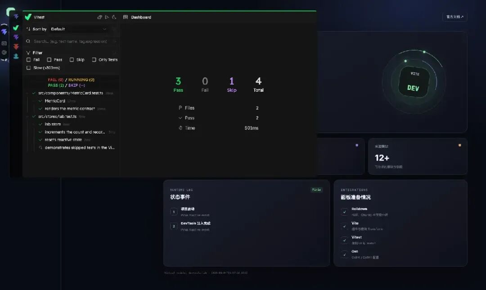

配置：
```

import { defineConfig } from 'vite'  
import { DevTools } from '@vitejs/devtools'  
  
export default defineConfig({  
  plugins: [  
    DevTools()  
  ]  
})  

```

启动：
```

pnpm dev  

```

打开应用页面后，**DevTools** 会以浮动面板形式显示。

这种体验类似：`Vue DevTools` 嵌入浏览器页面。

## 内置工具如何开启？

**Vite+ DevTools** 采用 **Dock** 架构。

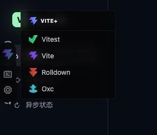

安装完成后，左侧 **Dock** 会显示：

  * `Rolldown`
  * `Vite`
  * `Vitest`
  * `Oxc`

等工具入口。

如果项目没有安装对应集成：

点击对应入口后，会自动安装相关 `package`。

重启开发服务器后即可使用。

# 项目信息一眼掌握

打开 **DevTools** 首页，可以直接看到项目运行环境。

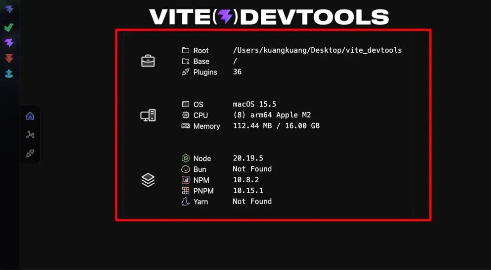

包括：

  * 项目路径
  * Vite 配置
  * Plugin 数量
  * Node 版本
  * 包管理器
  * 系统信息

例如：
```

Plugins 36  
  
Node 22.20.0  
  
PNPM 10.15.1  

```

以前排查环境问题，需要翻：

  * package.json
  * lock 文件
  * vite.config

现在打开 DevTools 就能快速确认。

# Module Graph：项目依赖关系可视化

这是开发过程中非常实用的一块。

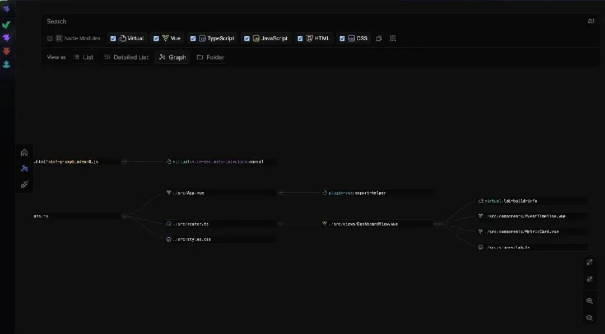

**Vite+ DevTools** 可以展示完整模块图。

支持查看：

  * Vue 文件
  * TypeScript
  * JavaScript
  * CSS
  * HTML
  * Node Modules
  * Virtual Module

同时提供：

  * List
  * Detailed List
  * Graph
  * Folder

多种查看方式。

大型项目里经常遇到：

“这个依赖是谁引入的？”

“为什么这个包进入 bundle？”

“哪个模块重复加载？”

这些问题以后可以直接通过图形化方式定位。

# Vite Plugin Inspector：插件执行链透明化

**Vite** 最大的特点就是插件体系。

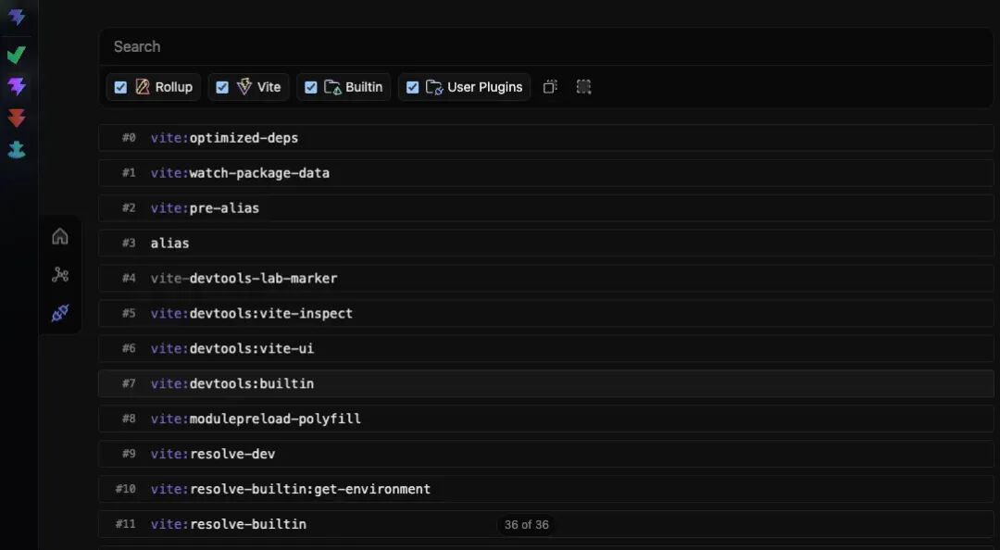

但插件调试一直比较麻烦。

以前：`写插件 → 打日志 → 猜生命周期`。

现在可以直接查看插件 **Pipeline** 。

例如：
```

resolveId  
  
load  
  
transform  
  
output  

```

每一个插件执行过程都会展示出来。

对于开发：

  * `Vite Plugin`
  * `Vue Plugin`
  * 自定义 `Loader`

效率提升非常明显。

# Rolldown DevTools：构建分析神器

这是未来 **Vite** 生态最值得关注的部分。

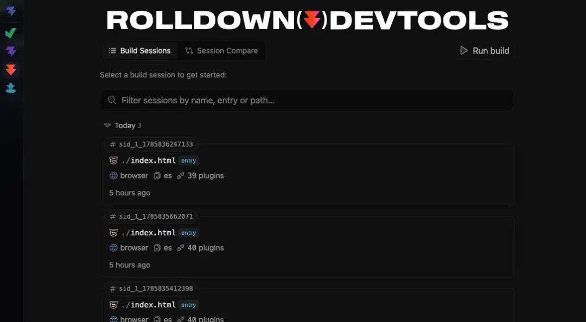

随着 **Vite** 进入 `Rolldown` 时代，构建能力会越来越强。

对应的 **DevTools** 可以分析：

  * `Build Session`
  * `Entry`
  * `Plugin`
  * `Chunk`
  * `Asset`

比如：

为什么打包体积变大？

哪个依赖占用最大？

哪个插件影响构建速度？

以前需要各种 analyzer 工具。

未来直接在 `Rolldown DevTools` 中查看。

# Vitest DevTools：测试统一入口

`Vitest` 也加入了 DevTools。

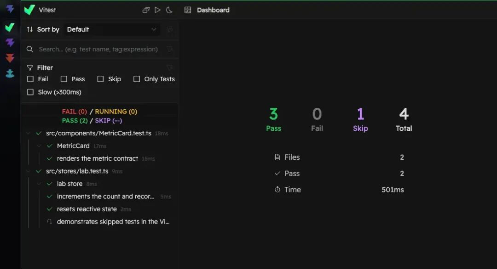

测试结果可以直接展示：

  * Pass
  * Fail
  * Skip
  * Test Files
  * 执行时间

并且支持展开查看具体测试：

哪个文件失败？

哪个 Case 耗时？

整个体验更接近 IDE。

# Oxc DevTools：Rust 工具链加入

随着 **VoidZero** 推进 **Rust** 工具链：`Oxc`

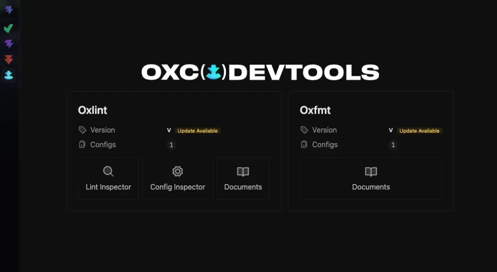

正在承担越来越多基础能力：

  * Parser
  * Linter
  * Formatter

**Vite+ DevTools** 也开始接入：

  * `Oxlint Inspector`
  * `Oxfmt Inspector`
  * Config Inspector

未来代码分析、格式化、构建优化都会更加统一。

# Vite+ DevTools 最大价值：生态插件接入

真正重要的不是现在这几个官方工具。

而是：**未来任何 Vite 插件，都可以拥有自己的 DevTools 面板。**

比如：

Vue 生态：`Vue Inspector`

CSS：`UnoCSS Inspector`

构建：`Rolldown Analyzer`

质量：`Oxlint Inspector`

测试：`Vitest Dashboard`

全部可以进入同一个入口。

**Vite+ DevTools** 本身更像一个平台。

第三方插件也可以通过 `DevTools Kit` 接入自己的能力。

# 写在最后

过去：Vite = 快速构建工具

现在：Vite 正在连接：

`Dev Server`

`Rolldown`

`Oxc`

`Vitest`

`DevTools`

形成完整工具链。

打开 **Vite+ DevTools** ，就能看到整个项目运行状态。

**Vite+ DevTools** 目前还处于快速迭代阶段，但方向已经非常明确：

**下一代前端开发环境，可能不只是浏览器 DevTools，而是工程级 DevTools。**

  * **Vite+ DevTools 官网** ：`https://devtools.vite.dev/`


