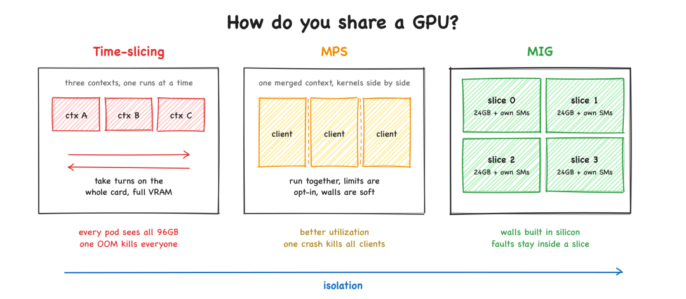
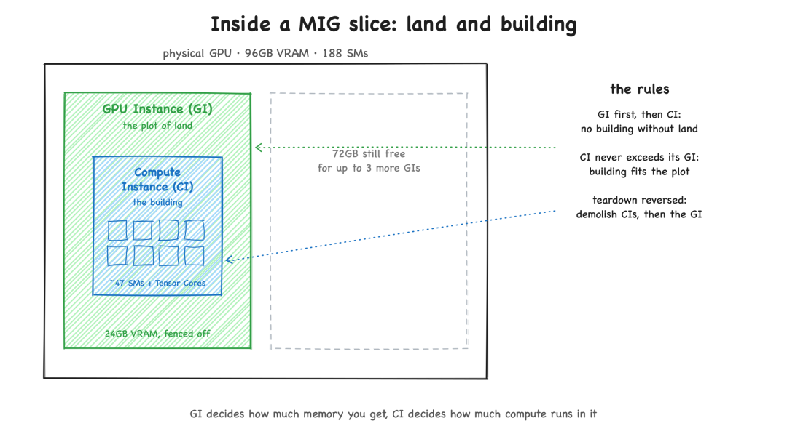
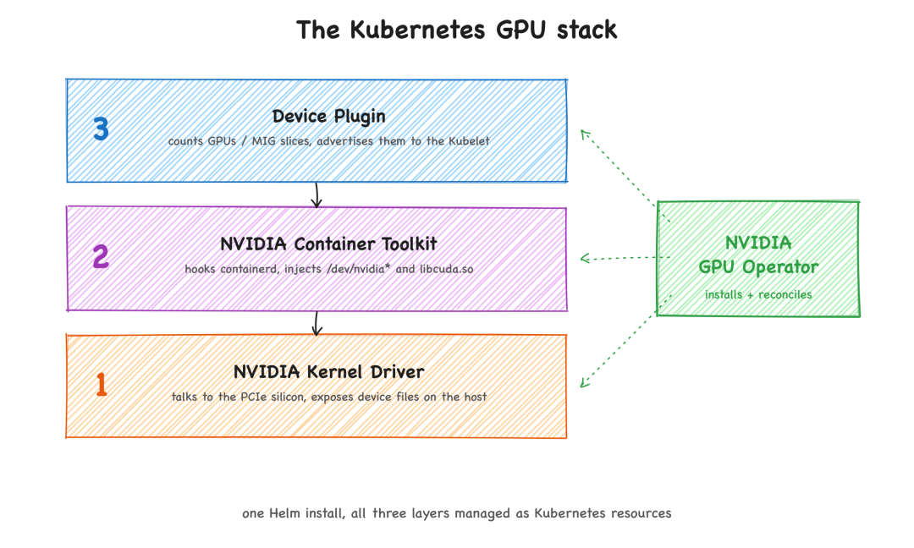
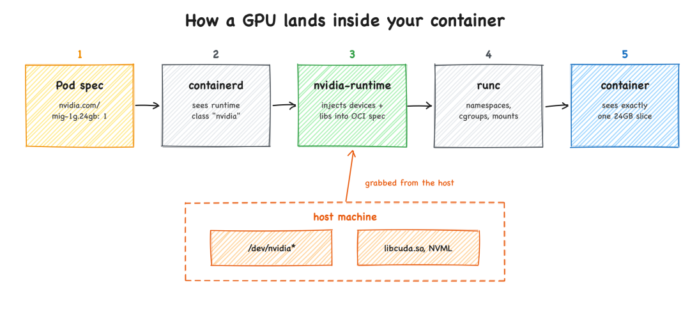
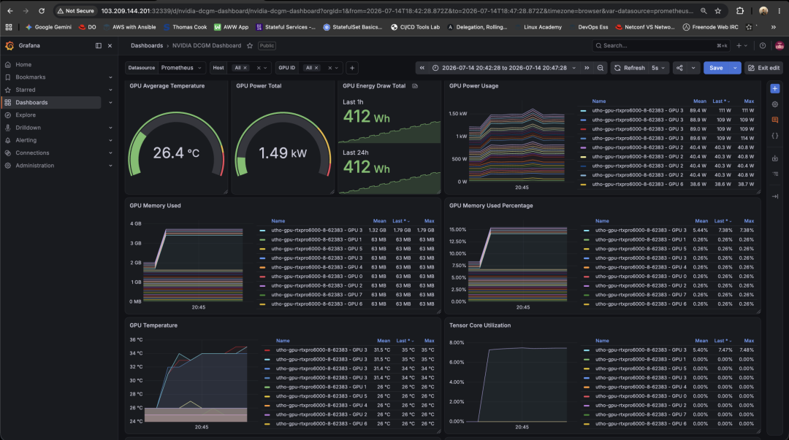
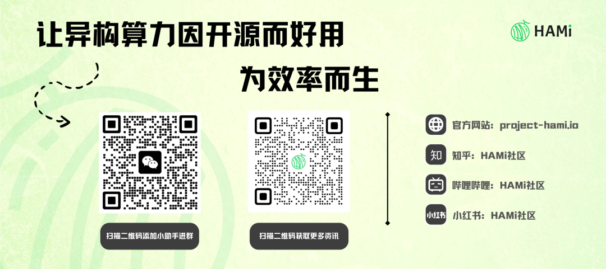

# 在 Kubernetes 上正确使用 NVIDIA MIG 共享 GPU：从 8 块 GPU 到 32 个隔离切片

**作者**: HAMi Project
**发布时间**: 2026-08-05 17:00
**原文链接**: https://mp.weixin.qq.com/s/RJB7zJ07AMYdXYB02Kf71Q

---


  

来源：https://blog.kubesimplify.com/slicing-gpus-in-kubernetes-with-nvidia-mig

作者：Shubham Katara&Saiyam Pathak

GPU 是集群中最昂贵的资源，也是共享效果最差的资源。CPU 可以切分到 millicores，内存可以按字节申请，但只要向 Kubernetes 请求 GPU，你就会拿到整张卡——全部 96GB——即便你的模型只需要 20GB。

本文要讲的就是如何解决这个问题。我们拿一台配置了 **8 块 NVIDIA RTX PRO 6000 Blackwell GPU** （共 768GB VRAM）的节点，用 **Multi-Instance GPU (MIG)** 把它切成 **32 个完全隔离的 24GB GPU 实例** 。先用 `nvidia-smi` 手工切，一块卡一块卡地操作，让你看清每一条命令，包括如何回滚；再一次性切完所有 8 块卡；最后用 NVIDIA GPU Operator 做声明式管理，让这套配置能在单次 SSH 会话之外持续存活。

本文适合的读者：

  * • 平台工程师和 SRE：在 Kubernetes 中运维 GPU 节点，且已经厌倦了看着 96GB 的卡大部分时间在空转。
  * • 需要在共享 AI 基础设施上获得硬件级租户隔离，同时还要让财务对利用率满意的团队。

读到最后，你会看到一个 PyTorch 工作负载运行在一个硬件隔离的切片上，并且你能从容器内外两个角度证明隔离确实生效。

虽然这套设置是在单节点上验证的，但这里的内容没有任何单节点特定的限制。无论你有几个 GPU 节点，原理都一样。

## 问题所在：Kubernetes 总是按整块 GPU 分发

下面这个场景在各地的 GPU 集群上每天都在上演。

你的团队准备了一台配备 8 块 NVIDIA RTX PRO 6000 Blackwell GPU 的节点，部署了标准的 Kubernetes GPU Operator，节点资源被注册为 `nvidia.com/gpu: 8`。

然后某位开发者部署了一个轻量的 LLM 推理 Pod，或一个小型 PyTorch 训练任务。Kubernetes 给它分配了一整块 GPU。这个工作负载声明占用了整张 96GB Blackwell 卡，但实际只用 20GB。

剩下的 76GB 就这样闲置着。

因为标准 GPU 是作为不可分割资源来调度的，八个小工作负载会锁住八整块卡。你的平台于是没有任何可调度的 GPU 容量，排队延迟被人为推高，整个集群只发挥了它财务和算力潜力的一小部分。

这时你就不得不回答一个尴尬的问题：开发团队在抱怨 GPU 不够用，而你又要如何向财务解释集群利用率为何如此之低？

解决办法就是 GPU 共享。但“共享一块 GPU”具体意味着什么，取决于你的实现方式——选错机制，就会出现一个租户的内存泄漏把另一个租户的训练任务搞崩这种情况。

## 共享 GPU 的三种方式

NVIDIA 提供了三种机制，可以把多个工作负载放到同一块卡上。要理解它们为何表现差异如此大，你得先搞清楚一个进程使用 GPU 时到底发生了什么。

### 首先：进程是如何与 GPU 对话的

GPU 就像是一只装满小工人的大箱子。我们这块卡有 188 个这样的工人（NVIDIA 把每一个称作 **Streaming Multiprocessor（流多处理器，SM）** ），它们都在同时做数值运算。这种并行性正是 GPU 速度快的根本原因。

你实际的程序运行在 CPU 上。当它需要 GPU 时，会与显卡建立一个 **会话** （技术名词叫作  _CUDA context（CUDA 上下文）_ ）。这个会话就是程序在 GPU 上的私有工作区：里面存放着程序在 GPU 内存中的数据，以及它要运行的小型 GPU 内核程序（每一个称作 **kernel** ）。每个程序都有属于自己的会话，而一个会话永远无法读取另一个会话的内存。

让共享变得棘手的关键就在这里：**默认情况下，GPU 同一时间只运行一个会话。** 假设你的程序很轻量，只让 188 个工人中的 20 个忙活，其余 168 个并不会交给别人，它们就那么闲着——因为现在轮到你，整块卡在你完成之前都是你的。第二个程序没法把自己的工作塞进那些空闲的工人里，它只能排队。

也就是说，开箱即用的 GPU 是一台单租户机器：一次跑一个程序，其他人都在等。下面每一种方法都是在从不同角度攻击这同一个问题。

GPU 共享的频谱：时间片轮转、MPS 与 MIG 对比

### 时间片轮转：高速轮换

时间片轮转保留了“一次一个”的规则，只是把每一轮的时间切得很短，所以它  _感觉_ 像在共享。想象有一间会议室和三个团队：团队 A 用几分钟，出来；团队 B 进去；然后团队 C；再循环。GPU 也是如此：程序 A 占有整块卡片刻，然后被冻结，程序 B 拿到卡，然后 C，再回到 A。它们在轮换。永远没有任何东西真正并行运行。

这种做法有两个问题。

**切换有真实的时间成本。** 每次换手，卡都得把当前程序正在做的所有中间状态保存下来，再加载下一个程序的状态。GPU 上这种状态非常多，所以换手本身就会消耗掉本可用于实际工作的时间。

**没有任何机制来保证公平。** 在 CPU 上，操作系统会强制每个人公平轮换，所以单个程序没法独占整台机器。GPU 的时间片轮转没有这样的裁判：没有保证的轮次时长，也没有优先级。一个不断用连续工作占住卡的程序会一直占着不放，其他程序就饿死。（老一些的 GPU 更糟：只有当一个程序  _完成_ 了它正在做的那段工作后，卡才能换手，所以一个长任务会把所有人都冻住，直到它跑完。新一代的 GPU 可以中途把长任务打断，这有所改善，但仍然无法保证公平份额。）

还有一个值得了解的实际差异：这对训练和推理的伤害并不相同。训练任务跑的是又长又重、把整块卡占满的工作，强制它轮换只会让所有人都变慢。推理通常是以短脉冲的形式运行，中间有空隙，挤进共享的轮次里要舒服得多。

这也是为什么 Kubernetes 的“time-slicing”特性有些名不副实。它并不公平地分配时间，只是告诉 Kubernetes“这一块 GPU 其实是四块”，让四个 Pod 落到上面，然后让它们自己去抢轮次。一个更老实的叫法是超额订阅（oversubscription）：Kubernetes 以为有四块 GPU，而硬件知道只有一块。

而最大的缺口在内存——内存根本没被划分。每个 Pod 都从同一个 GPU 内存池里取用，没有任何机制追踪谁本该用多少。如果某个 Pod 把内存用光（或发生泄漏），下一个向 GPU 申请内存的 Pod 就会被拒绝并崩溃，而这并不是它自己的错。时间片轮转适合开发机或可信任的突发式任务，但它不是真正的隔离。

### MPS：所有人共享一个会话

时间片轮转让所有那些工人在每一轮里都空着。MPS（Multi-Process Service）用一个技巧直接针对这种浪费下手：既然 GPU 同一时间只运行一个会话，那就把  _所有人_ 都放进同一个会话里。

一个 helper 进程坐在卡的前面。每个程序把自己的工作交给这个 helper，helper 再把所有工作喂给 GPU，就好像它们都来自一个表现良好的单一程序。因为现在只有一个会话，不同程序的工作确实是在不同工人上同时运行的。三个各需 20% 算力的轻量服务可以一起运行并把卡填满，而不是轮流、让大部分算力闲置。对于大量小任务来说，这是实打实的加速。

代价就是这个技巧的另一面。一旦所有人都进入一个共享会话，程序之间天然的墙就没了。你  _可以_ 让 MPS 给每个程序在算力或内存上设上限，但这些上限是你主动选择的限制，不是硬件强制的墙。而且所有人共享同一个命运：只要有一个程序严重崩溃，它就可能把共享的 helper 拖垮，helper 一死，每个程序的 GPU 工作都跟着死。（现代 GPU 至少能阻止一个程序读取另一个程序的数据。）MPS 在一个团队把自己的若干任务塞到一张卡上时最闪亮，它不是你放不可信陌生人的地方。

### MIG：真正地把卡切开

MIG（Multi-Instance GPU）不再玩轮换的游戏，而是从物理上把卡切成几块更小的 GPU。每一块都有自己固定的一块内存和固定的一组工人，与其它部分完全隔离。每一块 mini-GPU 都同时运行各自的会话，因为从硬件角度看，它  _就是_ 一块独立的、更小的 GPU。

这一下把三个问题都解决了。内存不够？你只会用尽  _你自己_ 切片的内存，邻居完全感知不到。有喧闹邻居抢占算力？不可能，因为它的工人和你的工人在物理上就是不同的工人，它的内存流量也走的是独立的通道，所以你的速度保持稳定。崩溃？只局限在你的切片里。对你的工作负载而言，一个切片看起来就是一块更小的、行为可预测的 GPU。

|        |
|        | 时间片轮转          | MPS              | MIG          |
|--------|----------------|------------------|--------------|
| 机制     | 高速轮换           | 所有人共享一个会话        | 切分硬件本身       |
| 并行性    | 无（轮流）          | 真并行（共享工人）        | 真并行（独立硬件）    |
| 隔离     | 无              | 软件隔离（共享会话）       | 硬件隔离（硅片级别）   |
| 内存保护   | 无，单一共享池        | 可选的限制            | 由硬件强制        |
| 故障爆炸半径 | 整块卡            | 整块卡（helper 死则全死） | 单个切片         |
| 性能     | 不稳定，有上下文切换开销   | 对小内核程序友好         | 可预测，专用单元     |
| 最适用于   | 开发/测试、可信的突发式任务 | 一个团队把自己的任务塞进一张卡  | 有真实租户边界的共享平台 |

如果你正在构建一个让不同团队、客户或环境共享同一块硅片的平台，三者中只有 MIG 给你的是硬件保证，而不是一句承诺。这正是本文要讲的机制。

在你下定决心前有一个提醒：MIG 需要受支持的硬件（A100/A30 Ampere 起、Hopper、Blackwell，包括本文使用的 RTX PRO 6000 Server Edition），并且一个 MIG 切片不能超过一块物理卡。如果你的模型需要超过 96GB，那你该解决的不是 MIG，而是多 GPU。

## 前置条件

要跟着实操，你需要一台 GPU 节点的 root 权限和一个 Kubernetes 集群的管理员权限。下面是本套设置中使用的具体基础设施：

  * • **宿主机操作系统：** 运行在 Utho Cloud 上的 Enterprise Linux 虚拟机（基于 Ubuntu）。
  * • **云服务商：** Utho Cloud。
  * • **Kubernetes：** v1.35.6
  * • **GPU Operator Chart：** gpu-operator-v26.3.3
  * • **容器运行时：**` containerd`。
  * • **CPU：** 256 核。
  * • **内存：** 1259GB。
  * • **GPU：** 8 块 NVIDIA RTX PRO 6000 Blackwell Server Edition（96GB VRAM，每块卡 188 个流多处理器 / SM）。
  * • **NVIDIA 宿主机驱动：**` 610.43.02`，**CUDA：**` 13.3`。

```

root@gpu-rtxpro6000-8:~# nvidia-smi -L  
GPU 0: NVIDIA RTX PRO 6000 Blackwell Server Edition (UUID: GPU-8b89b58e-b427-108d-ac50-06138d78fe78)  
GPU 1: NVIDIA RTX PRO 6000 Blackwell Server Edition (UUID: GPU-03a041b7-8abf-360a-d1a2-dfd70188cd5f)  
GPU 2: NVIDIA RTX PRO 6000 Blackwell Server Edition (UUID: GPU-ba09367f-dd50-32ca-e988-7ff66bece885)  
GPU 3: NVIDIA RTX PRO 6000 Blackwell Server Edition (UUID: GPU-30512c46-708b-f374-5698-ee24be6cd626)  
GPU 4: NVIDIA RTX PRO 6000 Blackwell Server Edition (UUID: GPU-4c395b7a-a7e6-d90f-1ced-d96e8dd68288)  
GPU 5: NVIDIA RTX PRO 6000 Blackwell Server Edition (UUID: GPU-04dc48d7-7048-aef5-ad36-f5db716e7668)  
GPU 6: NVIDIA RTX PRO 6000 Blackwell Server Edition (UUID: GPU-f4f5db98-143f-0a8d-47ce-956fab39a736)  
GPU 7: NVIDIA RTX PRO 6000 Blackwell Server Edition (UUID: GPU-f4c61521-240a-da09-2787-e576034e197e)
```

## MIG 心智模型：GPU 实例与计算实例

在切 GPU 之前，先搞清楚一个切片到底包含什么，这点至关重要。

每一个切片都由一个 **GPU 实例（GI）** 和一个 **计算实例（CI）** 组成。理解它们最简单的方式是：

  1. 1\. **GPU 实例（GI）就是那块地。** 创建 GI 时，你划出一块物理上的 VRAM 及其内存控制器。这块地在硅片级别被安全地围了起来。GPU 上的任何其它分区或进程都无法越过这条边界、也无法访问这块内存。
  2. 2\. **计算实例（CI）就是建在那块地上的房子。** 房子里装着执行机构：负责真正做数学运算的流多处理器（SM）和 Tensor Core。

GPU 实例是那块地，计算实例是地上的房子

GI 与 CI 之间的关系是严格分层的：

  * • **没有地就建不了房。** 没有先创建父级 GPU 实例，就无法建立计算实例。执行单元必须有一个专属的内存边界才能运行。
  * • **大小约束。** 房子（CI）的容量不能超过地块（GI）的面积。你分配的计算切片（SM）数量不能超过父级 VRAM 切片天然支持的规模。
  * • **再分割。** 你可以建一座大房子（一个 CI 占满整个 GI），也可以把地块分成几份，盖多座更小的房子（多个更小的 CI）。后一种情况下，这些计算实例并行运行，共享父级 GI 的同一个 VRAM 池，但各自的执行核心保持严格隔离。
  * • **拆除顺序很重要。** 房子还立着（CI 还存在）时，你无法清掉地块（销毁 GI）。驱动会拒绝这条命令。你必须先拆房（销毁所有 CI），再收地（销毁父级 GI）。这条规则在后文的实操拆除步骤中会再次出现。

为什么要同时切分内存和算力？如果只切分内存、让计算核心共享，你会有多个相互隔离的存储单元，却只有一双手要同时去访问它们，必然造成拥堵。如果只切分计算核心、却共享内存池，你就有多个独立的工人在同一张纸上写字，必然引发冲突和数据损坏。把两者都切分，每个租户就有了自己上锁的文件柜和专属的工人。

### 如何读懂 MIG profile 名称

NVIDIA 的 profile 遵循 `{X}g.{Y}gb` 这种命名规则：

  * • **`{Y}gb`** 是 VRAM 分区（GI 层）。
  * • **`{X}g`** 是计算切片数。

RTX PRO 6000 Blackwell 共有 188 个 SM，它的硅片被划分为 **4 个基础计算切片** 。因此一个 **`1g.24gb`** 切片大约拿到整块卡的 1/4：**46 个 SM** 配上一块 24GB 的 VRAM 分区。（之所以略少于规整的四分之一，是因为驱动会保留几个 SM 不分出来，所以四个切片合起来用到 188 中的 184 个。）`2g.48gb` 切片拿到一半，而 `4g.96gb` 则是把整块卡作为单个 MIG 实例来表达。

你还会看到带后缀的变体，例如 `1g.24gb-me`（去掉了视频解码/编码引擎的纯计算切片）和 `1g.24gb+me.all`（一个独占卡上全部媒体引擎的切片）。稍后我们会直接从驱动里看到完整列表。

## 实操第 1 部分：对一块 GPU 进行端到端切片

本节所有操作都发生在宿主机上，不涉及 Kubernetes。我们会把 GPU 0 走一遍完整生命周期：检查、启用、查看、切分、验证、运行，然后再全部拆回去。如果你理解了这一节，本文剩下的部分就只是自动化而已。

### Step 0：检查当前 MIG 模式
```

root@gpu-rtxpro6000-8:~# nvidia-smi -i 0 --query-gpu=index,name,mig.mode.current --format=csv  
index, name, mig.mode.current  
0, NVIDIA RTX PRO 6000 Blackwell Server Edition, Disabled
```

`-i 0` 指定 GPU 索引 0。去掉 `-i` 参数，同一条查询会打印机箱里每一块卡的状态。

### Step 1：停掉占用 GPU 的守护进程

这里有两个看起来相似、但在负载下表现截然不同的操作：

  * • **切换 MIG 模式（` nvidia-smi -mig 1`）：** 在 Ampere A100 这样的老架构上，启用 MIG 会强制进行一次破坏性的 GPU 重置。从 Hopper 和 Blackwell 起，这只是驱动里一次无破坏的逻辑切换。
  * • **切分切片（` nvidia-smi mig -cgi ...`）：** 这一步就会真正动到物理层。这条命令会强制 GPU 的内存控制器去切分硅片上的内存交叉开关。只要有任何进程哪怕占着 1MB 的 VRAM，操作就会以 `Device or resource busy` 失败。

在企业级系统上，通常有两个后台服务会持有 GPU 设备文件的句柄：

  1. 1\. **`nvidia-persistenced` ：** 让驱动常驻在内核内存中，避免新 CUDA 进程启动时的延迟。
  2. 2\. **`nvidia-fabricmanager` ：** 用于通过 NVSwitch 互连的多 GPU 系统（HGX 基板）。如果你的 GPU 像我们这样直接插在 PCIe 上，这个服务不会存在。

按你的实际情况停掉对应的服务：
```

root@gpu-rtxpro6000-8:~# sudo systemctl stop nvidia-persistenced
```

还要确保你要切分的那块 GPU 上没有运行任何 CUDA 工作负载（Ollama server、Jupyter kernel、任何东西）。`nvidia-smi` 会在输出的底部显示活跃进程。

### Step 2：在 GPU 0 上启用 MIG 模式
```

root@gpu-rtxpro6000-8:~# sudo nvidia-smi -i 0 -mig 1  
Enabled MIG Mode for GPU 00000000:01:00.0  
   
Warning: persistence mode is disabled on device 00000000:01:00.0. See the Known Issues section of the nvidia-smi(1) man page for more information. Run with [--help | -h] switch to get more information on how to enable persistence mode.  
All done.
```

这条警告是意料之中的：上一步是我们亲手停掉了 `nvidia-persistenced`，驱动只是在指出来而已。如果驱动因为仍有客户端附着而无法切换模式，它会把这个 GPU 报告为处于  _pending enable（待启用）_ 状态。杀掉剩余的客户端（或重启），模式就会激活。

此时 GPU 处于 MIG 模式但没有任何切片，这意味着 **在你切出实例之前，任何 CUDA 工作负载都无法使用它** 。一个已启用但空白的 MIG GPU 在算力层面等同于下线。不要走到一半停下来。

### Step 3：查看这块卡支持哪些 profile

问驱动它能切出哪些形状：
```

root@gpu-rtxpro6000-8:~# nvidia-smi mig -i 0 -lgip  
+-------------------------------------------------------------------------------+  
| GPU instance profiles:                                                        |  
| GPU   Name               ID    Instances   Memory     P2P    SM    DEC   ENC  |  
|                                Free/Total   GiB              CE    JPEG  OFA  |  
|===============================================================================|  
|   0  MIG 1g.24gb         14     4/4        23.62      No     46     1     1   |  
|                                                               1     1     0   |  
+-------------------------------------------------------------------------------+  
|   0  MIG 1g.24gb+me      21     1/1        23.62      No     46     1     1   |  
|                                                               1     1     1   |  
+-------------------------------------------------------------------------------+  
|   0  MIG 1g.24gb+gfx     47     4/4        23.62      No     46     1     1   |  
|                                                               1     1     0   |  
+-------------------------------------------------------------------------------+  
|   0  MIG 1g.24gb+me.all  65     1/1        23.62      No     46     4     4   |  
|                                                               1     4     1   |  
+-------------------------------------------------------------------------------+  
|   0  MIG 1g.24gb-me      67     4/4        23.62      No     46     0     0   |  
|                                                               1     0     0   |  
+-------------------------------------------------------------------------------+  
|   0  MIG 2g.48gb          5     2/2        47.38      No     94     2     2   |  
|                                                               2     2     0   |  
+-------------------------------------------------------------------------------+  
|   0  MIG 2g.48gb+gfx     35     2/2        47.38      No     94     2     2   |  
|                                                               2     2     0   |  
+-------------------------------------------------------------------------------+  
|   0  MIG 2g.48gb+me.all  64     1/1        47.38      No     94     4     4   |  
|                                                               2     4     1   |  
+-------------------------------------------------------------------------------+  
|   0  MIG 2g.48gb-me      66     2/2        47.38      No     94     0     0   |  
|                                                               2     0     0   |  
+-------------------------------------------------------------------------------+  
|   0  MIG 4g.96gb          0     1/1        95.12      No     188    4     4   |  
|                                                               4     4     1   |  
+-------------------------------------------------------------------------------+  
|   0  MIG 4g.96gb+gfx     32     1/1        95.12      No     188    4     4   |  
|                                                               4     4     1   |  
+-------------------------------------------------------------------------------+
```

这张表要仔细看，它是你这张卡的真相之源：

  * • **ID** 是可在创建命令中使用的数字 profile ID（`14` 和名称 `1g.24gb` 可以互换）。
  * • **Instances Free/Total** 告诉你每种 profile 能塞下几个：四个 1g.24gb 切片，或两个 2g.48gb，或一个 4g.96gb。
  * • **SM** 确认了算力切分：46/94/188 个 SM。
  * • 带后缀的变体则重新分配了媒体引擎和图形支持。每一个普通切片都已经按比例分到了一部分媒体引擎（`1g.24gb` 那一行显示一个 NVDEC 和一个 NVENC）。后缀会改变这一点：`-me` 把它们剥掉，得到纯计算切片；`+me.all` 把卡上全部的解码/编码引擎交给单个切片（因此只能是 1/1）；`+gfx`（Blackwell 上新增）则在切片内启用图形 API。

你也可以问这些切片在卡上物理落在哪些位置：
```

root@gpu-rtxpro6000-8:~# nvidia-smi mig -i 0 -lgipp  
GPU  0 Profile ID 14 Placements: {0,3,6,9}:3  
GPU  0 Profile ID 21 Placements: {0,3,6,9}:3  
GPU  0 Profile ID 47 Placements: {0,3,6,9}:3  
GPU  0 Profile ID 65 Placements: {0,3,6,9}:3  
GPU  0 Profile ID 67 Placements: {0,3,6,9}:3  
GPU  0 Profile ID  5 Placements: {0,6}:6  
GPU  0 Profile ID 35 Placements: {0,6}:6  
GPU  0 Profile ID 64 Placements: {0,6}:6  
GPU  0 Profile ID 66 Placements: {0,6}:6  
GPU  0 Profile ID  0 Placement : {0}:12  
GPU  0 Profile ID 32 Placement : {0}:12
```

把卡上的内存想象成一排 12 个等大的停车位。一个 `1g.24gb` 切片是一辆占 3 个位的小车，`2g.48gb` 是一辆占 6 个位的长车，整卡 `4g.96gb` 则占满全部 12 个位。`{0,3,6,9}:3` 这种写法只是列出了每种大小允许停在哪儿：小切片可以从第 0、3、6、9 位开始；`2g.48gb` 需要连续 6 个位，所以只能从 0 或 6 开始。

这正是碎片化咬人的地方。假设你把一个小切片从第 3 位开始停，另一个从第 6 位开始停。你用掉了 12 个位中的 6 个，所以卡看起来还有一半是空的，但空位是 0-2 和 9-11：两段各 3 个位的空隙。`2g.48gb` 需要连续 6 个位，而剩下的位里没有一段连续 6 个，所以它塞不进去，哪怕一半内存还闲着。解决办法是提前规划布局（先切大切片，或让所有切片等大），而不是临时一个个加、最后把自己逼到死角。

### Step 4：切分切片

用一条命令创建四个 `1g.24gb` GPU 实例，每个实例里都建好对应的计算实例。`-cgi` 创建 GPU 实例（地块），`-C` 参数则立即在每一个里面盖出对应的计算实例（房子）：
```

root@gpu-rtxpro6000-8:~# sudo nvidia-smi mig -i 0 -cgi 1g.24gb,1g.24gb,1g.24gb,1g.24gb -C  
Successfully created GPU instance ID  3 on GPU  0 using profile MIG 1g.24gb (ID 14)  
Successfully created compute instance ID  0 on GPU  0 GPU instance ID  3 using profile MIG 1g.24gb (ID  0)  
Successfully created GPU instance ID  4 on GPU  0 using profile MIG 1g.24gb (ID 14)  
Successfully created compute instance ID  0 on GPU  0 GPU instance ID  4 using profile MIG 1g.24gb (ID  0)  
Successfully created GPU instance ID  5 on GPU  0 using profile MIG 1g.24gb (ID 14)  
Successfully created compute instance ID  0 on GPU  0 GPU instance ID  5 using profile MIG 1g.24gb (ID  0)  
Successfully created GPU instance ID  6 on GPU  0 using profile MIG 1g.24gb (ID 14)  
Successfully created compute instance ID  0 on GPU  0 GPU instance ID  6 using profile MIG 1g.24gb (ID  0)
```

`sudo nvidia-smi mig -i 0 -cgi 14,14,14,14 -C` 用上面表里的 profile ID 做的是完全一样的事。

你不必把它们都切成一样大。想在同一块卡上服务一个大租户和两个小租户？混用 profile：
```

root@gpu-rtxpro6000-8:~# sudo nvidia-smi mig -i 0 -cgi 2g.48gb,1g.24gb,1g.24gb -C  
Successfully created GPU instance ID  1 on GPU  0 using profile MIG 2g.48gb (ID  5)  
Successfully created compute instance ID  0 on GPU  0 GPU instance ID  1 using profile MIG 2g.48gb (ID  1)  
Successfully created GPU instance ID  5 on GPU  0 using profile MIG 1g.24gb (ID 14)  
Successfully created compute instance ID  0 on GPU  0 GPU instance ID  5 using profile MIG 1g.24gb (ID  0)  
Successfully created GPU instance ID  6 on GPU  0 using profile MIG 1g.24gb (ID 14)  
Successfully created compute instance ID  0 on GPU  0 GPU instance ID  6 using profile MIG 1g.24gb (ID  0)  
   
root@gpu-rtxpro6000-8:~# nvidia-smi mig -i 0 -lgi  
+---------------------------------------------------------+  
| GPU instances:                                          |  
| GPU   Name               Profile  Instance   Placement  |  
|                            ID       ID       Start:Size |  
|=========================================================|  
|   0  MIG 1g.24gb           14        5          6:3     |  
+---------------------------------------------------------+  
|   0  MIG 1g.24gb           14        6          9:3     |  
+---------------------------------------------------------+  
|   0  MIG 2g.48gb            5        1          0:6     |  
+---------------------------------------------------------+
```

一个 48GB 的半卡切片（布局 0:6）加上两个 24GB 的四分之一卡切片（6:3 和 9:3），布局网格加起来正好是 12。这就是你如何从单块物理 GPU 上服务一个大 LLM 和两个小推理服务、且彼此之间有硬边界的做法。在本文接下来的部分里，我们坚持使用统一的四切片布局，所以如果你刚才跟着做了混合布局，请把它拆掉（`-dci`，然后 `-dgi`），重新创建四个 `1g.24gb` 切片。

### Step 5：验证切片确实存在

同一真相的三个视角。设备列表：
```

root@gpu-rtxpro6000-8:~# nvidia-smi -L  
GPU 0: NVIDIA RTX PRO 6000 Blackwell Server Edition (UUID: GPU-8b89b58e-b427-108d-ac50-06138d78fe78)  
  MIG 1g.24gb     Device  0: (UUID: MIG-445da789-865d-5fd1-b2b6-32a48bf66c39)  
  MIG 1g.24gb     Device  1: (UUID: MIG-e78fd5d2-f2de-5632-8961-9a368cec8080)  
  MIG 1g.24gb     Device  2: (UUID: MIG-b8861912-6285-56a1-99ca-297ac0f38ddb)  
  MIG 1g.24gb     Device  3: (UUID: MIG-f46c5ab9-40ef-54a2-b796-a2101a6ed56d)  
GPU 1: NVIDIA RTX PRO 6000 Blackwell Server Edition (UUID: GPU-03a041b7-8abf-360a-d1a2-dfd70188cd5f)  
...
```

每一个 MIG 设备都有自己的 UUID。这正是稍后 Kubernetes 设备插件识别并调度这些切片的方式。

GPU 实例（地块）及其物理布局：
```

root@gpu-rtxpro6000-8:~# nvidia-smi mig -i 0 -lgi  
+---------------------------------------------------------+  
| GPU instances:                                          |  
| GPU   Name               Profile  Instance   Placement  |  
|                            ID       ID       Start:Size |  
|=========================================================|  
|   0  MIG 1g.24gb           14        3          0:3     |  
+---------------------------------------------------------+  
|   0  MIG 1g.24gb           14        4          3:3     |  
+---------------------------------------------------------+  
|   0  MIG 1g.24gb           14        5          6:3     |  
+---------------------------------------------------------+  
|   0  MIG 1g.24gb           14        6          9:3     |  
+---------------------------------------------------------+
```

每个实例占据 12 格布局网格中的 3 格，和 `-lgipp` 承诺的一模一样。再看看它们里面的计算实例（房子）：
```

root@gpu-rtxpro6000-8:~# nvidia-smi mig -i 0 -lci  
+--------------------------------------------------------------------+  
| Compute instances:                                                 |  
| GPU     GPU       Name             Profile   Instance   Placement  |  
|       Instance                       ID        ID       Start:Size |  
|         ID                                                         |  
|====================================================================|  
|   0      3       MIG 1g.24gb          0         0          0:1     |  
+--------------------------------------------------------------------+  
|   0      4       MIG 1g.24gb          0         0          0:1     |  
+--------------------------------------------------------------------+  
|   0      5       MIG 1g.24gb          0         0          0:1     |  
+--------------------------------------------------------------------+  
|   0      6       MIG 1g.24gb          0         0          0:1     |  
+--------------------------------------------------------------------+
```

### Step 6：在切片上跑点东西（无需 Kubernetes）

MIG 切片可以直接从宿主机上通过 UUID 寻址。在集群介入之前先做点冒烟测试会很方便。只要宿主机上能用 PyTorch（一个简单的 `python3 -m venv` 加上 `pip install torch --index-url https://download.pytorch.org/whl/cu130` 就够了），就能把进程绑定到 `nvidia-smi -L` 里第一个切片的 UUID：
```

root@gpu-rtxpro6000-8:~# CUDA_VISIBLE_DEVICES=MIG-445da789-865d-5fd1-b2b6-32a48bf66c39 python3 -c "  
import torch  
print('device count:', torch.cuda.device_count())  
print('device name :', torch.cuda.get_device_name(0))  
print('total memory:', torch.cuda.get_device_properties(0).total_memory // 2**20, 'MiB')"  
device count: 1  
device name : NVIDIA RTX PRO 6000 Blackwell Server Edition MIG 1g.24gb  
total memory: 24192 MiB
```

进程恰好只看到一块设备，它自我标识为一个 `1g.24gb` 切片，拥有 24192 MiB 显存，而不是整块卡的 97887 MiB。隔离在宿主机层面就已经生效了，根本不需要 Kubernetes。

### Step 7：全部拆除（关闭 MIG）

你重新配置切片的频率会远超你的想象：profile 大小会变、租户来来去去、有时你只是想把整块卡拿回来跑一次大训练。记住那条分层规则：先拆房再收地。先算计算实例，再算 GPU 实例，最后才是模式本身。

销毁 GPU 0 上的计算实例：
```

root@gpu-rtxpro6000-8:~# sudo nvidia-smi mig -i 0 -dci  
Successfully destroyed compute instance ID  0 from GPU  0 GPU instance ID  3  
Successfully destroyed compute instance ID  0 from GPU  0 GPU instance ID  4  
Successfully destroyed compute instance ID  0 from GPU  0 GPU instance ID  5  
Successfully destroyed compute instance ID  0 from GPU  0 GPU instance ID  6
```

然后是 GPU 实例：
```

root@gpu-rtxpro6000-8:~# sudo nvidia-smi mig -i 0 -dgi  
Successfully destroyed GPU instance ID  3 from GPU  0  
Successfully destroyed GPU instance ID  4 from GPU  0  
Successfully destroyed GPU instance ID  5 from GPU  0  
Successfully destroyed GPU instance ID  6 from GPU  0
```

如果你在 `-dci` 之前运行 `-dgi`，驱动会拒绝。下面是你真的这么干时实际发生的情况：
```

root@gpu-rtxpro6000-8:~# sudo nvidia-smi mig -i 0 -dgi  
Unable to destroy GPU instance ID  3 from GPU  0: In use by another client  
Failed to destroy GPU instances: In use by another client
```

这就是“地块与房子”规则在硅片层面的强制执行：还立在 GI 3 上的那个 CI 就是那个“另一个客户端”。

另外注意：有工作负载在跑的切片没法被销毁。先停掉使用它的 Pod 或进程，否则 `-dci` 会以同样的  _In use by another client_ 错误失败。

现在关闭 MIG 模式：
```

root@gpu-rtxpro6000-8:~# sudo nvidia-smi -i 0 -mig 0  
Disabled MIG Mode for GPU 00000000:01:00.0  
   
Warning: persistence mode is disabled on device 00000000:01:00.0. See the Known Issues section of the nvidia-smi(1) man page for more information. Run with [--help | -h] switch to get more information on how to enable persistence mode.  
All done.
```

确认这块卡又变回完整的，然后把我们在 Step 1 停掉的持久化守护进程拉回来：
```

root@gpu-rtxpro6000-8:~# nvidia-smi -i 0 --query-gpu=index,mig.mode.current --format=csv  
index, mig.mode.current  
0, Disabled  
   
root@gpu-rtxpro6000-8:~# nvidia-smi -L | head -1  
GPU 0: NVIDIA RTX PRO 6000 Blackwell Server Edition (UUID: GPU-8b89b58e-b427-108d-ac50-06138d78fe78)  
   
root@gpu-rtxpro6000-8:~# sudo systemctl start nvidia-persistenced
```

一块 GPU，完整生命周期，两个方向都走过。这就是 MIG 的全部机械内核。

## 实操第 2 部分：一次切完 8 块 GPU

上面所有命令都用 `-i 0` 来针对某一块卡。扩展到全部卡上的技巧简单得有些尴尬：**去掉` -i` 参数，每条命令就会对所有 GPU 生效**。

到处启用 MIG：
```

root@gpu-rtxpro6000-8:~# sudo systemctl stop nvidia-persistenced  
root@gpu-rtxpro6000-8:~# sudo nvidia-smi -mig 1  
Enabled MIG Mode for GPU 00000000:01:00.0  
Enabled MIG Mode for GPU 00000000:21:00.0  
Enabled MIG Mode for GPU 00000000:41:00.0  
Enabled MIG Mode for GPU 00000000:61:00.0  
Enabled MIG Mode for GPU 00000000:81:00.0  
Enabled MIG Mode for GPU 00000000:A1:00.0  
Enabled MIG Mode for GPU 00000000:C1:00.0  
Enabled MIG Mode for GPU 00000000:E1:00.0  
All done.
```

（这里裁掉了针对每块 GPU 的 persistence-mode 警告；它们和我们在第 1 部分看到的那条是一样的。）

一条命令在每块启用了 MIG 的卡上切出四个切片。8 块 GPU 上都会出现相同的 GI ID 3 到 6：
```

root@gpu-rtxpro6000-8:~# sudo nvidia-smi mig -cgi 1g.24gb,1g.24gb,1g.24gb,1g.24gb -C  
Successfully created GPU instance ID  3 on GPU  0 using profile MIG 1g.24gb (ID 14)  
Successfully created compute instance ID  0 on GPU  0 GPU instance ID  3 using profile MIG 1g.24gb (ID  0)  
Successfully created GPU instance ID  4 on GPU  0 using profile MIG 1g.24gb (ID 14)  
Successfully created compute instance ID  0 on GPU  0 GPU instance ID  4 using profile MIG 1g.24gb (ID  0)  
Successfully created GPU instance ID  5 on GPU  0 using profile MIG 1g.24gb (ID 14)  
Successfully created compute instance ID  0 on GPU  0 GPU instance ID  5 using profile MIG 1g.24gb (ID  0)  
Successfully created GPU instance ID  6 on GPU  0 using profile MIG 1g.24gb (ID 14)  
Successfully created compute instance ID  0 on GPU  0 GPU instance ID  6 using profile MIG 1g.24gb (ID  0)  
... (identical output repeats for GPU 1 through GPU 7) ...  
   
root@gpu-rtxpro6000-8:~# sudo systemctl start nvidia-persistenced
```

验证一下。这是关键时刻——8 块物理卡现在呈现出 32 个隔离设备：
```

root@gpu-rtxpro6000-8:~# nvidia-smi -L  
   
GPU 0: NVIDIA RTX PRO 6000 Blackwell Server Edition (UUID: GPU-8b89b58e-b427-108d-ac50-06138d78fe78)  
  MIG 1g.24gb     Device  0: (UUID: MIG-445da789-865d-5fd1-b2b6-32a48bf66c39)  
  MIG 1g.24gb     Device  1: (UUID: MIG-e78fd5d2-f2de-5632-8961-9a368cec8080)  
  MIG 1g.24gb     Device  2: (UUID: MIG-b8861912-6285-56a1-99ca-297ac0f38ddb)  
  MIG 1g.24gb     Device  3: (UUID: MIG-f46c5ab9-40ef-54a2-b796-a2101a6ed56d)  
GPU 1: NVIDIA RTX PRO 6000 Blackwell Server Edition (UUID: GPU-03a041b7-8abf-360a-d1a2-dfd70188cd5f)  
  MIG 1g.24gb     Device  0: (UUID: MIG-c614986b-8ca6-5114-b292-f7fdf532b32e)  
  MIG 1g.24gb     Device  1: (UUID: MIG-ba182ecc-31c1-5a67-92f1-b6f14f39cc2f)  
  MIG 1g.24gb     Device  2: (UUID: MIG-5976103f-bae0-5bd9-8de2-efcb0651ae5d)  
  MIG 1g.24gb     Device  3: (UUID: MIG-09aa478f-191b-55ce-a012-235285f56a44)  
GPU 2: NVIDIA RTX PRO 6000 Blackwell Server Edition (UUID: GPU-ba09367f-dd50-32ca-e988-7ff66bece885)  
  MIG 1g.24gb     Device  0: (UUID: MIG-07cdcefa-6330-5da7-9f25-0686ef5e6e7d)  
  MIG 1g.24gb     Device  1: (UUID: MIG-91b206d2-cfbb-57d3-9ffb-00151f932469)  
  MIG 1g.24gb     Device  2: (UUID: MIG-83bf707a-b369-5de9-a22a-e882e2a15f23)  
  MIG 1g.24gb     Device  3: (UUID: MIG-db98d829-38c6-5490-ab37-54b3c1911690)  
GPU 3: NVIDIA RTX PRO 6000 Blackwell Server Edition (UUID: GPU-30512c46-708b-f374-5698-ee24be6cd626)  
  MIG 1g.24gb     Device  0: (UUID: MIG-2d5513c3-03f4-54f0-9c70-688f7472c927)  
  MIG 1g.24gb     Device  1: (UUID: MIG-471a3e25-40ba-5794-9d7b-2dfa7aa0a0ab)  
  MIG 1g.24gb     Device  2: (UUID: MIG-f8584627-55b2-52be-ac92-0b4708e7dad6)  
  MIG 1g.24gb     Device  3: (UUID: MIG-6e4f5dfc-7e1f-59dc-9fec-a13642abcd08)  
GPU 4: NVIDIA RTX PRO 6000 Blackwell Server Edition (UUID: GPU-4c395b7a-a7e6-d90f-1ced-d96e8dd68288)  
  MIG 1g.24gb     Device  0: (UUID: MIG-0b090ecd-97b3-5022-b410-353a54064db3)  
  MIG 1g.24gb     Device  1: (UUID: MIG-12e12a0a-56aa-5258-9cce-fb652a6d60ca)  
  MIG 1g.24gb     Device  2: (UUID: MIG-e80daae6-94df-5114-b105-f4b8e14fe00c)  
  MIG 1g.24gb     Device  3: (UUID: MIG-c652619d-ef73-5243-8313-163ba19341ce)  
GPU 5: NVIDIA RTX PRO 6000 Blackwell Server Edition (UUID: GPU-04dc48d7-7048-aef5-ad36-f5db716e7668)  
  MIG 1g.24gb     Device  0: (UUID: MIG-ac982967-d17f-5636-8641-078e3f7ee88a)  
  MIG 1g.24gb     Device  1: (UUID: MIG-9a6a33e8-352c-5b71-8523-7918f07f19d3)  
  MIG 1g.24gb     Device  2: (UUID: MIG-dcdb7566-7372-56e3-ac66-29bbc7332280)  
  MIG 1g.24gb     Device  3: (UUID: MIG-61f3820e-e817-5ae1-ac70-7d4ccc6752bd)  
GPU 6: NVIDIA RTX PRO 6000 Blackwell Server Edition (UUID: GPU-f4f5db98-143f-0a8d-47ce-956fab39a736)  
  MIG 1g.24gb     Device  0: (UUID: MIG-fdae208b-7b6b-5360-b14d-7943f835591d)  
  MIG 1g.24gb     Device  1: (UUID: MIG-bd87ccf3-dd60-556b-8fae-dd76a00f9f32)  
  MIG 1g.24gb     Device  2: (UUID: MIG-4eb83867-7a48-50ec-98e4-590ca4a34bdb)  
  MIG 1g.24gb     Device  3: (UUID: MIG-aa39a320-78fe-54f3-a33f-4e14a69a34fc)  
GPU 7: NVIDIA RTX PRO 6000 Blackwell Server Edition (UUID: GPU-f4c61521-240a-da09-2787-e576034e197e)  
  MIG 1g.24gb     Device  0: (UUID: MIG-83e26b2c-d325-5f9e-b6ab-1dd76bf49ee0)  
  MIG 1g.24gb     Device  1: (UUID: MIG-769267a5-61cf-5391-815c-df1af5592f2f)  
  MIG 1g.24gb     Device  2: (UUID: MIG-bd09eec4-b779-57ff-b2e9-0c5dd4db132d)  
  MIG 1g.24gb     Device  3: (UUID: MIG-0f8a469f-1116-5095-9e94-65e7809b554d)
```

现在每块物理卡都能独立服务 4 个租户，每个租户都得到一个硬件隔离的切片。8 块卡加起来，就是 32 个可调度 GPU，而你之前只有 8 个——你一块新卡都没买。

全集群范围的拆除也是同样的套路，只是不带 `-i`，顺序依然严格不变。先拆所有计算实例，再拆所有 GPU 实例（各有 32 行 "Successfully destroyed"，这里只保留到最后一块 GPU），然后才是模式本身：
```

root@gpu-rtxpro6000-8:~# sudo nvidia-smi mig -dci  
...  
Successfully destroyed compute instance ID  0 from GPU  7 GPU instance ID  3  
Successfully destroyed compute instance ID  0 from GPU  7 GPU instance ID  4  
Successfully destroyed compute instance ID  0 from GPU  7 GPU instance ID  5  
Successfully destroyed compute instance ID  0 from GPU  7 GPU instance ID  6  
   
root@gpu-rtxpro6000-8:~# sudo nvidia-smi mig -dgi  
...  
Successfully destroyed GPU instance ID  3 from GPU  7  
Successfully destroyed GPU instance ID  4 from GPU  7  
Successfully destroyed GPU instance ID  5 from GPU  7  
Successfully destroyed GPU instance ID  6 from GPU  7  
   
root@gpu-rtxpro6000-8:~# sudo nvidia-smi -mig 0  
Disabled MIG Mode for GPU 00000000:01:00.0  
Disabled MIG Mode for GPU 00000000:21:00.0  
Disabled MIG Mode for GPU 00000000:41:00.0  
Disabled MIG Mode for GPU 00000000:61:00.0  
Disabled MIG Mode for GPU 00000000:81:00.0  
Disabled MIG Mode for GPU 00000000:A1:00.0  
Disabled MIG Mode for GPU 00000000:C1:00.0  
Disabled MIG Mode for GPU 00000000:E1:00.0  
All done.  
   
root@gpu-rtxpro6000-8:~# nvidia-smi --query-gpu=index,mig.mode.current --format=csv  
index, mig.mode.current  
0, Disabled  
1, Disabled  
2, Disabled  
3, Disabled  
4, Disabled  
5, Disabled  
6, Disabled  
7, Disabled
```

又是八块完整的 GPU 了，像什么都没发生过一样。

## 把 Kubernetes 介绍进来：GPU Operator

我们刚才手工做的那些都管用，但它不扩展。你没法把一串 `nvidia-smi` 命令搞成 GitOps 并在整个集群上维护它们。而且宿主机上的切片对 Kubernetes 来说是不可见的，直到有东西把它们上报给 Kubelet。

要在容器里跑 GPU 工作负载，需要三个相互独立的层协同工作，而 **NVIDIA GPU Operator** 把这一切都帮你管起来：

由 GPU Operator 管理的三层 Kubernetes GPU 技术栈

**第 1 层：宿主机内核驱动。** 直接装在宿主机操作系统上。它与物理 PCIe 硅片对接，暴露出诸如 `/dev/nvidia0` 和 `/dev/nvidiactl` 这样的字符设备文件。它既不知道也不在乎 Kubernetes 的存在。

**第 2 层：Container Toolkit（OCI 集成）。**` containerd` 这样的容器运行时能切分 CPU 和内存，但它们没法原生管理 GPU。**NVIDIA Container Toolkit** 挂载到 containerd 里：当容器请求 GPU 时，它把驱动文件（`/dev/nvidia*`、`libcuda.so`）挂载进该容器的命名空间。

**第 3 层：Kubernetes 设备插件。** 一个 DaemonSet，查询宿主机驱动，清点可用的 GPU 或 MIG 切片，并作为可调度容量上报给 Kubelet。

用 Helm 安装这个 operator：
```

root@gpu-rtxpro6000-8:~# helm repo add nvidia https://helm.ngc.nvidia.com/nvidia  
root@gpu-rtxpro6000-8:~# helm repo update  
root@gpu-rtxpro6000-8:~# helm install gpu-operator nvidia/gpu-operator \  
  -n gpu-operator --create-namespace \  
  --set mig.strategy=mixed
```

关于 `mig.strategy` 这个参数，它控制切片以什么样的 Kubernetes 资源形式出现：

  * • **`single`** （默认）：节点上所有 GPU 都使用同一个统一的 profile，切片以普通的 `nvidia.com/gpu` 上报。工作负载甚至都不知道有 MIG 介入。
  * • **`mixed` ：** 每种 profile 都作为独立的资源上报，比如 `nvidia.com/mig-1g.24gb` 或 `nvidia.com/mig-2g.48gb`。当不同卡带着不同的几何形状，或工作负载需要显式选择切片大小时，这就是你要的。

本文使用 `mixed`，这样切片类型就能端到端可见。

这个 operator 在 `gpu-operator` 命名空间里部署了这些组件：

  * • **`gpu-operator` （controller）：** 监视 `ClusterPolicy` 自定义资源，并在每个 GPU 节点上对下面所有 DaemonSet 进行调谐。
  * • **`node-feature-discovery (NFD)` ：** 扫描宿主机硬件并给节点打标签（例如 `nvidia.com/gpu.present=true`）。
  * • **`gpu-feature-discovery (GFD)` ：** 添加细粒度的 GPU 标签，例如显存大小、型号以及激活的 MIG profile（例如 `nvidia.com/mig.config=all-1g.24gb`）。
  * • **`nvidia-container-toolkit` ：** 在 `/etc/containerd/config.toml` 中注册 `nvidia` runtime class：

```

[plugins.'io.containerd.cri.v1.runtime'.containerd.runtimes.'nvidia']  
  runtime_type = "io.containerd.runc.v2"  
   
[plugins.'io.containerd.cri.v1.runtime'.containerd.runtimes.'nvidia'.options]  
  BinaryName = "/usr/local/nvidia/toolkit/nvidia-container-runtime"  
  SystemdCgroup = true
```

  * • **`nvidia-device-plugin` ：** 查询驱动的 NVML 库获取 MIG 切片的 UUID，并上报给 Kubelet（例如 `nvidia.com/mig-1g.24gb: 32`）。
  * • **`nvidia-mig-manager` ：** 监视 `nvidia.com/mig.config` 节点标签，以声明式方式重新配置 MIG 几何形状。下文会展开讲。
  * • **`nvidia-dcgm-exporter` ：** 在 Prometheus 的 `/metrics` 端点上暴露每个切片的硬件遥测。
  * • **`nvidia-operator-validator` ：** 跑一个一次性 CUDA 任务，在用户 Pod 落地之前验证从软件到硬件的整条流水线。

### 声明式 MIG：一个标签顶上那一堆命令

装上 operator 之后，上文那一整段实操就压缩成了单个节点标签：
```

root@gpu-rtxpro6000-8:~# kubectl label node <node-name> nvidia.com/mig.config=all-1g.24gb --overwrite
```

MIG Manager 注意到这个标签，并通过一个结构化的循环来编排完整生命周期：

  1. 1\. **驱逐 GPU 工作负载：** 把该节点的 GPU 可分配量置为 `0`，并排空（drain）GPU Pod 以释放设备锁。
  2. 2\. **停掉遥测守护进程：** 暂停设备插件和 DCGM exporter，让 NVML 不再有客户端。
  3. 3\. **重置状态：** 清理 VRAM 和任何已存在的 MIG 几何形状。
  4. 4\. **应用新几何形状：** 启用 MIG 模式，并像我们手工命令那样切出 GI 和 CI。
  5. 5\. **重新生成 CDI spec：** 写出新的 Container Device Interface 配置，让运行时能注入新设备。
  6. 6\. **恢复整个技术栈：** 重启设备插件和 exporter，由它们把 32 个新切片上报给 Kubelet。

从集群侧验证：
```

root@gpu-rtxpro6000-8:~# kubectl describe node <node-name> | grep mig-1g.24gb  
  nvidia.com/mig-1g.24gb:  32
```

要回到整块 GPU 的状态，关闭路径同样只是一个标签。`all-disabled` 会销毁所有切片并关闭 MIG 模式，节点又会上报 `nvidia.com/gpu: 8`：
```

root@gpu-rtxpro6000-8:~# kubectl label node <node-name> nvidia.com/mig.config=all-disabled --overwrite
```

混合几何形状也是可以的：内置 profile 如 `all-balanced`，或在 `mig-parted` ConfigMap 里定义自定义布局，让不同的卡有不同的形状。我们用 `-cgi 2g.48gb,1g.24gb,1g.24gb` 做的一切都有声明式的等价物。

### NVIDIA runtime 如何把 GPU 注入到容器里

要理解为什么那些 containerd 配置块是必要的，下面看一下 Pod 实际启动时的流程：

NVIDIA runtime 如何把 GPU 设备注入到容器里

  1. 1\. **Pod 提交：** 开发者提交一个请求 GPU 的 Pod（`nvidia.com/gpu: 1` 或某个具体的 MIG 资源）。
  2. 2\. **containerd 拦截：** containerd 看到这个 Pod 使用 `nvidia` runtime class，准备容器。
  3. 3\. **nvidia-container-runtime（中间人）：** 读取容器环境（例如携带 MIG UUID 的 `NVIDIA_VISIBLE_DEVICES`），在宿主机上找到 `/dev/nvidia*` 下匹配的设备文件以及 `libcuda.so` 等驱动库，并把它们注入到该容器的 OCI spec 里。
  4. 4\. **runc 执行：** 修改后的 spec 交给 `runc`，由它建立命名空间、cgroup 和挂载，然后启动容器。
  5. 5\. **工作负载运行：** 容器里的 PyTorch 或 TensorFlow 原生地与自己的 GPU 切片对话，因为设备和库已经在握手阶段被注入进来了。

## 生产环境常见坑及解决办法

这里先给你一份速查版本，就按你凌晨两点撞到它们的样子排列：

| 症状                                               | 可能原因                                     | 解决办法                                                |
|--------------------------------------------------|------------------------------------------|-----------------------------------------------------|
| Toolkit 找不到 containerd，或 runtime class 始终不出现     | 非标准的 containerd 路径（RKE2/K3s）             | 通过 Helm 环境变量覆盖，把 toolkit 指向正确的 socket 和 config（坑 A） |
| 安装 Operator 后，你手工切的切片消失了                         | 当没有节点标签时，MIG Manager 默认采用 `all-disabled` | 用匹配的 `nvidia.com/mig.config` profile 给节点打标签（坑 B）    |
| 你在宿主机上改了切片，但 Kubernetes 显示的还是旧布局，Operator 日志冻住不动 | MIG Manager 只对节点标签事件作反应，它从不轮询硬件          | 重启 MIG Manager Pod 或来回切换标签以强制触发调谐（坑 C）              |
| 手工 MIG 模式下：Kubelet 始终发现不了新切片                     | 没有任何东西告诉设备插件硬件变了                         | 在 Helm 里禁用 `migManager`，然后重启设备插件 DaemonSet（坑 D）     |

下面是详细说明。

### 坑 A：非标准的 containerd socket 配置

GPU Operator 假定 containerd socket 和配置文件都是默认路径。如果你的环境是通过 RKE2 跑 containerd 的，就必须在 Helm 安装时显式地把 toolkit 指向那些非标准路径：
```

toolkit:  
  env:  
    - name: CONTAINERD_CONFIG  
      value: /var/lib/rancher/rke2/agent/etc/containerd/config.toml  
    - name: CONTAINERD_SOCKET  
      value: /run/k3s/containerd/containerd.sock  
    - name: CONTAINERD_RUNTIME_CLASS  
      value: nvidia  
    - name: CONTAINERD_SET_AS_DEFAULT  
      value: "true"
```

### 坑 B：MIG Manager 覆盖宿主机配置

如果 `nvidia-mig-manager` Pod 处于活跃状态，并且发现某个节点没有配置标签，它就会默认采用 `all-disabled` profile，把你之前在宿主机层面手工切的一切都清掉。你那些精心敲下的 `nvidia-smi` 工作，全没了。

**解决办法：** 给你的节点打上合适的标签，让它与 operator 的配置对齐：
```

root@gpu-rtxpro6000-8:~# kubectl label node <node-name> nvidia.com/mig.config=all-1g.24gb --overwrite
```

### 坑 C：MIG Manager 检测不到的宿主机状态漂移

如果你直接在宿主机上用 `nvidia-smi` CLI 手工删除或修改 MIG profile，这些改动不会反映到 Kubernetes 里，而 operator 对此会完全沉默。

**根因：**` nvidia-mig-manager` 监视的是 **Kubernetes 节点标签事件** 。它不会持续轮询宿主机的物理 GPU 寄存器。因为你的手工修改不会触发 Kubernetes 事件，所以这个 manager 一直处于空闲状态，以为旧状态仍然成功应用着（它的日志会一直冻住）。

**解决办法（针对 operator 管理的 MIG）：** 触发一次调谐事件。要么重启 MIG Manager Pod（它启动时会强制做一次完整检查），要么把节点标签来回切一下：
```

# Option 1: Restart the MIG Manager daemonset  
root@gpu-rtxpro6000-8:~# kubectl rollout restart daemonset -n gpu-operator nvidia-mig-manager  
   
# Option 2: Toggle the node label to trigger the watch loop  
root@gpu-rtxpro6000-8:~# kubectl label node <node-name> nvidia.com/mig.config=all-disabled --overwrite  
# Wait 10 seconds, then re-apply:  
root@gpu-rtxpro6000-8:~# kubectl label node <node-name> nvidia.com/mig.config=all-1g.24gb --overwrite
```

### 坑 D：为手工 MIG 配置强制让 Kubelet 发现

也许你想要的是相反的安排：用实操章节里那些精确的命令在宿主机上手工管理 MIG 切片，阻止 GPU Operator 永远不要覆盖它们，但又要让 Kubernetes 发现并在这些手工切片上调度工作负载。

**根因：** 当禁用了自动的 `nvidia-mig-manager` 来允许手工切片时，就没有任何自动化触发机制在宿主机 MIG 配置变化时通知 Kubelet 了。

**解决办法（强制 Kubelet 发现）：**

  1. 1\. **在 Helm 里禁用 MIG Manager** ，让 operator 永远不要抹掉你的手工设置：

```

root@gpu-rtxpro6000-8:~# helm upgrade --install gpu-operator nvidia/gpu-operator \  
  -n gpu-operator \  
  --set migManager.enabled=false \  
  --set mig.strategy=mixed
```

  1. 2\. **手工切分宿主机切片** ，用第 1 部分和第 2 部分里的 `nvidia-smi mig -cgi ... -C` 命令。
  2. 3\. **强制 Kubelet 发现** ，通过重启设备插件 DaemonSet：

```

root@gpu-rtxpro6000-8:~# kubectl rollout restart daemonset -n gpu-operator nvidia-device-plugin-daemonset
```

## 如何用 Prometheus 和 Grafana 监控 GPU 切片

一个平台的好坏只取决于它的可观测性。一旦你的 32 个 GPU 切片注册成功，你就需要一个集中化的仪表盘来监控诸如 VRAM 使用率、温度和 Tensor Core 利用率这些指标。

要做到这一点，部署 Prometheus 社区版技术栈，并把它接到 `nvidia-dcgm-exporter` 的遥测流上。

**Step 1：安装 kube-prometheus-stack。**
```

 root@gpu-rtxpro6000-8:~# helm repo add prometheus-community https://prometheus-community.github.io/helm-charts  
root@gpu-rtxpro6000-8:~# helm repo update  
   
root@gpu-rtxpro6000-8:~# helm install prometheus prometheus-community/kube-prometheus-stack \  
  -n monitoring --create-namespace
```

**Step 2：应用 ServiceMonitor。** 默认情况下，Prometheus 只扫描自己的命名空间。这份清单使用 `namespaceSelector` 来瞄准 `gpu-operator` 命名空间内的 `nvidia-dcgm-exporter` Service：
```

apiVersion: monitoring.coreos.com/v1  
kind: ServiceMonitor  
metadata:  
  name: nvidia-dcgm-exporter  
  # Deploy in the 'monitoring' namespace where Prometheus runs  
  namespace: monitoring  
  labels:  
    release: prometheus  
    app.kubernetes.io/instance: prometheus  
    app.kubernetes.io/managed-by: Helm  
spec:  
  # Scrapes the service in the gpu-operator namespace  
  namespaceSelector:  
    matchNames:  
    - gpu-operator  
  selector:  
    matchLabels:  
      # Matches the exact standard label created by the NVIDIA GPU Operator Helm chart  
      app: nvidia-dcgm-exporter  
  endpoints:  
  - port: gpu-metrics  
    interval: 15s  
    path: /metrics
```

应用它：
```

root@gpu-rtxpro6000-8:~# kubectl apply -f nvidia-servicemonitor.yaml
```

**Step 3：配置 Grafana 仪表盘。** NVIDIA 为 DCGM exporter 指标维护了一个官方仪表盘：

  1. 1\. 登录你的 Grafana UI。
  2. 2\. 进入 **Dashboards** -> **Import** 。
  3. 3\. 导入 **Dashboard ID：` 22515`**。
  4. 4\. 选择你的 Prometheus 数据源，点击 **Import** 。

这会加载一个交互式面板，展示所有 32 个分区的实时健康度和性能：

Grafana NVIDIA DCGM 仪表盘，展示每块 GPU 的功耗、显存、温度和 Tensor Core 利用率

## 在切片上跑真实工作负载（Blackwell，sm_120）

工作负载层还有最后一个坑在等着你。

NVIDIA Blackwell 架构使用了一个新的 compute capability 版本：**Compute Capability 12.0（` sm_120`）**。如果你使用较老的容器镜像（例如 `pytorch:2.1.2-cuda12.1`），执行时会崩溃：
```

RuntimeError: CUDA error: no kernel image is available for execution on the device
```

较老的 PyTorch 二进制根本不包含为 `sm_120` 编译的内核。请使用以 CUDA 12.8+ 编译的现代 PyTorch 镜像，或者官方的 **NVIDIA NGC PyTorch 容器** （`25.01-py3` 或更高版本），它们原生支持 Blackwell。

下面是经过验证的 Deployment 清单，它在一个 24GB 的 Blackwell MIG 切片上跑一个矩阵乘法负载。注意资源请求：`nvidia.com/mig-1g.24gb`，也就是我们的设备插件上报的、mixed 策略下的资源名：
```

apiVersion: apps/v1  
kind: Deployment  
metadata:  
  name: pytorch-mig-demo  
  labels:  
    app: pytorch-mig-demo  
spec:  
  replicas: 1  
  selector:  
    matchLabels:  
      app: pytorch-mig-demo  
  template:  
    metadata:  
      labels:  
        app: pytorch-mig-demo  
    spec:  
      runtimeClassName: nvidia  
      containers:  
      - name: pytorch  
        # NVIDIA's official PyTorch NGC container (25.01 or later)  
        # compiled to support the Blackwell architecture (sm_120)  
        image: nvcr.io/nvidia/pytorch:25.01-py3  
        command: ["python3", "-c"]  
        args:  
        - |  
          import torch  
          import time  
   
          print("=== CUDA MIG Slice Diagnostics ===")  
          print("CUDA Available:", torch.cuda.is_available())  
          if torch.cuda.is_available():  
              print("Device Name:", torch.cuda.get_device_name(0))  
              print("Device Capability:", torch.cuda.get_device_capability(0))  
              print("CUDA Device Count:", torch.cuda.device_count())  
   
              # Allocate memory and perform matrix multiplication to generate GPU load  
              print("Allocating tensors on GPU and starting matrix math load...")  
              device = torch.device("cuda")  
              x = torch.randn(10000, 10000, device=device)  
              y = torch.randn(10000, 10000, device=device)  
   
              # Keep running matrix multiplications to hold the CUDA context and load  
              while True:  
                  z = torch.matmul(x, y)  
                  time.sleep(0.5)  
          else:  
              print("ERROR: CUDA is not available inside the container!")  
              time.sleep(3600)  
        resources:  
          limits:  
            nvidia.com/mig-1g.24gb: 1  
          requests:  
            nvidia.com/mig-1g.24gb: 1
```

### 从两端证明隔离

Pod 跑起来之后，exec 进容器运行 `nvidia-smi`。你会观察到恰好 **一块 GPU** ，拥有 **24GB VRAM** 。容器看不到另外 7 块物理卡，也看不到其余 31 个切片：
```

root@gpu-rtxpro6000-8:~# kubectl exec -it pytorch-mig-demo-c9f7c8b49-sl5qh -- bash  
root@pytorch-mig-demo-c9f7c8b49-sl5qh:/workspace# nvidia-smi  
Tue Jul 14 19:44:18 2026  
+-----------------------------------------------------------------------------------------+  
| NVIDIA-SMI 610.43.02              KMD Version: 610.43.02     CUDA UMD Version: 13.3     |  
+-----------------------------------------+------------------------+----------------------+  
| GPU  Name                 Persistence-M | Bus-Id          Disp.A | Volatile Uncorr. ECC |  
| Fan  Temp   Perf          Pwr:Usage/Cap |           Memory-Usage | GPU-Util  Compute M. |  
|                                         |                        |               MIG M. |  
|=========================================+========================+======================|  
|   0  NVIDIA RTX PRO 6000 Blac...    On  |   00000000:61:00.0 Off |                   On |  
| N/A   34C    P0            108W /  600W |                  N/A   |     N/A      Default |  
|                                         |                        |              Enabled |  
+-----------------------------------------+------------------------+----------------------+  
   
+-----------------------------------------------------------------------------------------+  
| MIG devices:                                                                            |  
+------------------+----------------------------------+-----------+-----------------------+  
| GPU  GI  CI  MIG |              Shared Memory-Usage |        Vol|        Shared         |  
|      ID  ID  Dev |                Shared BAR1-Usage | SM     Unc| CE ENC  DEC  OFA  JPG |  
|                  |                                  |        ECC|                       |  
|==================+==================================+===========+=======================|  
|  0    6   0   0  |            1786MiB / 24192MiB    | 46      0 |  1   1    1    0    1 |  
|                  |               0MiB /  8317MiB    |           |                       |  
+------------------+----------------------------------+-----------+-----------------------+  
   
+-----------------------------------------------------------------------------------------+  
| Processes:                                                                              |  
|  GPU   GI   CI              PID   Type   Process name                        GPU Memory |  
|        ID   ID                                                               Usage      |  
|=========================================================================================|  
|    0    6    0                1      C   python3                                1714MiB |  
+-----------------------------------------------------------------------------------------+
```

这个 Pod 只能看到分给它的那个 `1g.24gb` 切片，其余什么也看不到，它那 24GiB 显存显示在 MIG devices 区域里。

现在从宿主机角度看同一时刻。宿主机能看到一切：所有卡、所有切片，以及那个在某个具体切片上烧显存的同一个 `python3` 进程（输出裁剪到两块 GPU 以保证可读）：
```

root@gpu-rtxpro6000-8:~# nvidia-smi  
   
Tue Jul 14 19:52:39 2026  
+-----------------------------------------------------------------------------------------+  
| NVIDIA-SMI 610.43.02              KMD Version: 610.43.02     CUDA UMD Version: 13.3     |  
+-----------------------------------------+------------------------+----------------------+  
| GPU  Name                 Persistence-M | Bus-Id          Disp.A | Volatile Uncorr. ECC |  
| Fan  Temp   Perf          Pwr:Usage/Cap |           Memory-Usage | GPU-Util  Compute M. |  
|                                         |                        |               MIG M. |  
|=========================================+========================+======================|  
|   2  NVIDIA RTX PRO 6000 Blac...    On  |   00000000:41:00.0 Off |                   On |  
| N/A   26C    P8             40W /  600W |     256MiB /  97887MiB |     N/A      Default |  
|                                         |                        |              Enabled |  
+-----------------------------------------+------------------------+----------------------+  
|   3  NVIDIA RTX PRO 6000 Blac...    On  |   00000000:61:00.0 Off |                   On |  
| N/A   36C    P0            108W /  600W |    1977MiB /  97887MiB |     N/A      Default |  
|                                         |                        |              Enabled |  
+-----------------------------------------+------------------------+----------------------+  
+-----------------------------------------------------------------------------------------+  
| MIG devices:                                                                            |  
+------------------+----------------------------------+-----------+-----------------------+  
| GPU  GI  CI  MIG |              Shared Memory-Usage |        Vol|        Shared         |  
|      ID  ID  Dev |                Shared BAR1-Usage | SM     Unc| CE ENC  DEC  OFA  JPG |  
|                  |                                  |        ECC|                       |  
|==================+==================================+===========+=======================|  
|  2    3   0   0  |              64MiB / 24192MiB    | 46      0 |  1   1    1    0    1 |  
|                  |               0MiB /  8317MiB    |           |                       |  
+------------------+----------------------------------+-----------+-----------------------+  
|  2    4   0   1  |              64MiB / 24192MiB    | 46      0 |  1   1    1    0    1 |  
|                  |               0MiB /  8317MiB    |           |                       |  
+------------------+----------------------------------+-----------+-----------------------+  
|  2    5   0   2  |              64MiB / 24192MiB    | 46      0 |  1   1    1    0    1 |  
|                  |               0MiB /  8317MiB    |           |                       |  
+------------------+----------------------------------+-----------+-----------------------+  
|  2    6   0   3  |              64MiB / 24192MiB    | 46      0 |  1   1    1    0    1 |  
|                  |               0MiB /  8317MiB    |           |                       |  
+------------------+----------------------------------+-----------+-----------------------+  
|  3    3   0   0  |              64MiB / 24192MiB    | 46      0 |  1   1    1    0    1 |  
|                  |               0MiB /  8317MiB    |           |                       |  
+------------------+----------------------------------+-----------+-----------------------+  
|  3    4   0   1  |              64MiB / 24192MiB    | 46      0 |  1   1    1    0    1 |  
|                  |               0MiB /  8317MiB    |           |                       |  
+------------------+----------------------------------+-----------+-----------------------+  
|  3    5   0   2  |              64MiB / 24192MiB    | 46      0 |  1   1    1    0    1 |  
|                  |               0MiB /  8317MiB    |           |                       |  
+------------------+----------------------------------+-----------+-----------------------+  
|  3    6   0   3  |            1786MiB / 24192MiB    | 46      0 |  1   1    1    0    1 |  
|                  |               0MiB /  8317MiB    |           |                       |  
+------------------+----------------------------------+-----------+-----------------------+  
+-----------------------------------------------------------------------------------------+  
| Processes:                                                                              |  
|  GPU   GI   CI              PID   Type   Process name                        GPU Memory |  
|        ID   ID                                                               Usage      |  
|=========================================================================================|  
|    3    6    0           698976      C   python3                                1714MiB |  
+-----------------------------------------------------------------------------------------+
```

同一个 `python3` 进程、同样的 1714MiB，两个视角都能看到，因为它们都在看同一个硬件隔离的 MIG 切片。那块卡上的其他切片各显示 64MiB 的空闲开销，完全不受正在跑的工作负载影响。这就是 MIG 的美妙之处。

## 平台属性对比

这是一份前后对比，正是你的财务和平台团队会用来评估的样子：

| 属性         | 8 块完整 GPU            | 32 个 MIG 切片              |
|------------|----------------------|--------------------------|
| 可调度 GPU 资源 | 8                    | 32                       |
| 小工作负载占用    | 整块 96GB 卡            | 一个 24GB 的硬件隔离切片          |
| 隔离模型       | 软件级（容器边界）            | 硅片级（内存交叉开关 + SM 通道）      |
| OOM 爆炸半径   | 可能影响整块卡              | 局限在 24GB 切片内             |
| 开发者等待时间    | 排在 8 块不可分割的卡后面       | 在 32 个切片上即时自助服务          |
| 配置方式       | 临时性的 `nvidia-smi` 脚本 | 通过 GPU Operator 用声明式节点标签 |

## 结论

GPU 共享是一个频谱。时间片轮转靠轮换来共享，MPS 靠信任邻居来共享，而 MIG 靠在硅片里砌墙来共享。当租户是真实存在的（不同团队、不同客户、不同爆炸半径）时，只有 MIG 能让你睡得着觉。

这一趟走下来，你完成了：

  1. 1\. 理解了三种 GPU 共享机制，以及为什么只有 MIG 给的是硬件强制的租户隔离。
  2. 2\. 学会了 GPU 实例 / 计算实例的分层关系，以及为什么 MIG 必须同时切分内存和算力。
  3. 3\. 手工把一块 GPU 走完了完整的 MIG 生命周期：启用、查看 profile、切分切片、验证、跑工作负载，最后把一切拆回到一整块卡。
  4. 4\. 通过去掉一个参数，把同样的命令扩展到全部 8 块 GPU，得到 32 个硬件隔离的 `1g.24gb` 实例。
  5. 5\. 部署了 NVIDIA GPU Operator，让整套配置变成声明式、对 GitOps 友好，用一个节点标签替代了那条手工命令序列。
  6. 6\. 诊断并修复了四个真实的生产环境坑：非标准 containerd 路径、MIG Manager 覆盖、宿主机状态漂移，以及手工模式下的 Kubelet 发现。
  7. 7\. 把 DCGM 遥测接入到 Prometheus + Grafana 仪表盘，获得切片级的可观测性。
  8. 8\. 通过在一个 `sm_120` 切片上跑 PyTorch 工作负载，从两端验证了隔离。

构建一个高效的 GPU 平台不只是拥有最快的硅片，更重要的是有效地管理和分发那个算力池。用 MIG 切分 Blackwell 架构，给你的是严格隔离、成本优化和开发者自助服务三者之间的平衡，而正是这种平衡让平台真正运转起来。

### 关于HAMi

HAMi 是由李孟轩与张潇共同发起的异构算力虚拟化与统一调度开源项目，现为 CNCF Incubating 项目，以“让异构算力因开源而好用”为目标，致力于提升异构算力利用率，并为异构 GPU 提供统一的复用接口。目前，HAMi 已支持 NVIDIA、昇腾、寒武纪、海光、天数智芯、摩尔线程、沐曦、燧原、昆仑芯、AWS Neuron、Vastai 等多种异构算力，与 Volcano、Kueue、Koordinator、vLLM、KAI Scheduler 等项目广泛集成，吸引了来自全球 20 多个国家和地区的 500 余名贡献者参与，并已在数百家企业实现生产落地。  



  
社区官网：https://project-hami.ioGitHub：https://github.com/Project-HAMi/HAMi  
  
  


