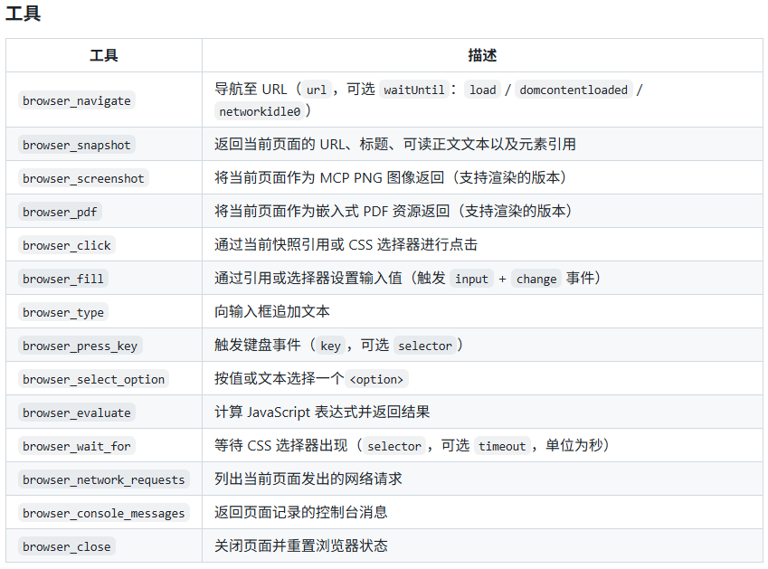

# 开源轻量无头浏览器Obscura，AI爬虫直接平替Chrome

**作者**: 飞翔的SA
**发布时间**: 2026-08-09 06:03
**原文链接**: https://mp.weixin.qq.com/s/b2jhSldjmuR3yfNgV2ZUrA

---


## 一、传统无头Chrome，规模化自动化的痛点

做爬虫、AI智能体网页交互的开发者，几乎都在用Headless Chrome。 但它天生适配桌面浏览，批量部署短板非常明显：

  * 单实例内存占用200MB以上，并发多开服务器成本暴涨
  * 启动要2秒，页面加载动辄500ms起步，效率低下
  * 安装包300MB+，部署、容器分发笨重
  * 无原生反检测能力，极易被网站识别拦截

基于Rust开发的开源工具Obscura，专门解决AI代理、网页抓取场景的资源与反爬难题，上线不久GitHub星标破万。

> 上一篇文章中[专为AI而生！Cloudflare推出轻量化浏览器Kitesurf](https://mp.weixin.qq.com/s?__biz=Mzk1Nzg5MzY4Mw==&mid=2247486191&idx=1&sn=bab8df1489b0640005ccd441c2315c9e&scene=21#wechat_redirect) ，灵感也来自于obscura

## 二、硬核性能：全方位碾压无头Chrome

Obscura专为大规模自动化打造，核心数据差距直观：

  1. 内存占用仅30MB，比Chrome省6倍资源，单机可跑数百并发
  2. 安装包仅70MB，Docker镜像压缩后仅57MB，部署更轻便
  3. 瞬时启动，无需等待；静态页面加载最快51ms，动态JS页面84ms
  4. 内置完整反指纹隐身模式，Chrome无原生能力

它内置V8引擎，完整执行页面JS，不会出现动态页面渲染空白问题。

## 三、独家Stealth隐身模式，爬虫防封利器

开启`--stealth`即可一键启用全套反检测能力：

  * 会话指纹随机化：屏幕、Canvas、音频、GPU参数每次刷新
  * 隐藏webdriver标识，完美模拟真实Chrome浏览器环境
  * 原生拦截3520个追踪、广告、指纹采集域名
  * 修复事件可信标识、原生函数特征，绕过绝大多数网站检测

不用额外搭配第三方隐身插件，开箱即用降低被封禁概率。

## 四、零改代码兼容 Puppeteer/Playwright

Obscura完整实现Chrome DevTools Protocol（CDP），属于开箱即用替换方案： 原有自动化脚本不需要修改逻辑，仅切换WebSocket连接地址即可。 支持页面跳转、元素点击、表单填写、网络拦截、Cookie管理等全量常用操作。 同时提供CLI命令行工具，一行代码完成网页抓取、并行批量爬取。

开启CDP服务指令

```

obscura serve --port 9222
# With stealth mode (anti-detection + tracker blocking)
obscura serve --port 9222 --stealth
```

## 五、原生适配AI智能体，内置MCP协议

专门面向AI Agent做深度适配，自带MCP服务，可直接对接Claude、Cursor等AI工具： 提供标准化浏览器操作指令：页面访问、元素点击、输入、等待选择器、执行JS、抓取网络日志等。 内置DOM转Markdown功能，一键输出AI友好的结构化文本，省去额外解析步骤。

开启MCP服务

标准输入输出（默认）——适用于 Claude Desktop 以及会启动子进程的 MCP 客户端：
```

obscura mcp
```

**HTTP** ——适用于通过网络连接的客户端：
```

obscura mcp --http --port 8080# endpoint: http://127.0.0.1:8080/mcp
```

可选标志（适用于两种传输方式）：

| 参数                  | 描述                 |
|---------------------|--------------------|
| `--proxy <URL>`     | HTTP/SOCKS5 代理     |
| `--user-agent <UA>` | 自定义 User-Agent 字符串 |
| `--stealth`         | 启用反检测模式            |

```

// claude mcp配置
{
  "mcpServers": {
    "obscura": {
      "command": "obscura",
      "args": ["mcp"]
    }
  }
}
```

MCP服务工具



## 六、极简部署，全平台支持

支持Linux、macOS、Windows多系统，三种部署方式任选：

  1. 二进制包：直接下载对应架构文件，无Chrome、Node依赖
  2. Docker容器：distroless极简镜像，轻量化线上部署
  3. 源码编译：Rust环境一键构建，自定义开启隐身功能

并行抓取、代理接入、JS内存限制、脚本超时等参数均可灵活配置，适配SPA单页应用、慢加载页面。

快速开始，使用以下指令

```

# Get the page title
obscura fetch https://example.com --eval "document.title"
# Extract all links
obscura fetch https://example.com --dump links
# Render JavaScript and dump HTML
obscura fetch https://news.ycombinator.com --dump html
# Write dump or eval output to a file
obscura fetch https://example.com --dump text --output page.txt
# Stream the raw response body verbatim (binary-safe; bypasses the JS/DOM layer).
# Use this for images, JSON, JS, CSS, or any non-HTML resource.
obscura fetch https://picsum.photos/200/300 --dump original > photo.jpg
# List every sub-resource URL the page would fetch (NDJSON; one record per asset)
obscura fetch https://example.com --dump assets
# Fetch through an HTTP or SOCKS proxy
obscura --proxy socks5://127.0.0.1:1080 fetch https://example.com --dump text
# Wait for dynamic content
obscura fetch https://example.com --wait-until networkidle0
# Bound navigation time for slow or broken pages
obscura fetch https://example.com --timeout 10
# Capture the settled page as PNG
obscura fetch https://example.com --screenshot page.png
# The screenshot flag also has a short form
obscura fetch https://example.com -s page.png
```

## 七、适用场景与局限

### 优先选择Obscura

  * 高并发网页爬虫、批量内容提取
  * AI智能体网页浏览、工具调用
  * 低成本云自动化、边缘轻量服务
  * 有反爬需求，不想额外集成隐身插件

### 暂时不适合

  * 需要完整WebGL、视频播放、复杂多媒体渲染
  * 对浏览器底层指纹高度定制的风控对抗场景

## 八、开源与后续规划

项目采用Apache 2.0开源协议，无功能阉割、永久免费。 官方正在开发托管云服务Obscura Cloud，提供代理托管、运维服务，不想自建服务的开发者可直接使用。 社区持续迭代，不断完善CDP协议覆盖、优化JS执行性能。

## 结语

在AI与爬虫需求爆发的当下，笨重的Chrome已经跟不上规模化需求。 Obscura以Rust高性能为基底，兼顾轻量化、反检测、AI适配三大核心优势，是自动化开发者低成本提效的优质开源方案。

