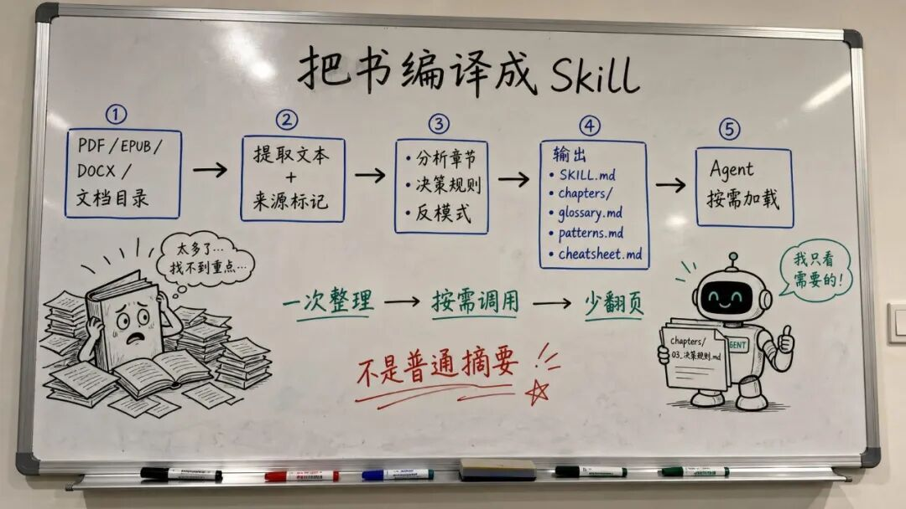
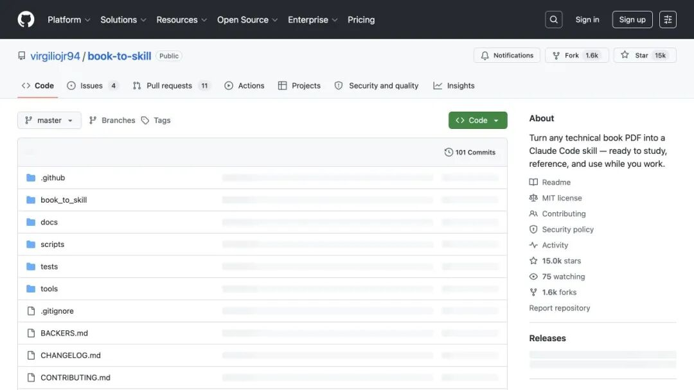

# 离大谱！15k Star book-to-skill，我惊到了！！！

**作者**: 小华同学ai
**发布时间**: 2026-08-04 07:41
**原文链接**: https://mp.weixin.qq.com/s/nMhyp44TmMORP-TIKBz1Rw

---

嗨，我是小华同学，专注解锁高效工作与前沿AI工具！每日精选开源技术、实战技巧，助你省时50%、领先他人一步。👉免费订阅，与10万+技术人共享升级秘籍！

  

  

> 很多人买技术书时信心满满，读完几章后也觉得“懂了”，但三个月后遇到问题，还是得重新翻 PDF、搜目录、找关键词。
> 
> **book-to-skill 的反差在于：它不把书再总结成一篇更短的文章，而是把书“编译”成 Agent 可以按需调用的 Skill。**
> 
> 你以后问 Agent `/your-book replication`，它不是凭印象聊天，而是加载对应章节、术语和方法，直接从整理后的知识结构里回答。


技术资料最容易出现三种浪费：

  * • PDF 在硬盘里，但 Agent 不知道它存在；
  * • 你做过笔记，但笔记变成一篇永远不会再打开的长文；
  * • 每次提问都让 Agent 重新翻目录、找章节、回忆上下文，既慢又费 Token。

传统的“把整本书塞进上下文”看起来直接，实际上会让模型面对过量内容；“只做摘要”又容易丢掉决策规则、反模式、代码示例和章节关联。

book-to-skill 选择了第三条路：**先付一次整理成本，把资料拆成结构化、可发现、可按需加载的知识资产。**

##  一句话理解 book-to-skill

**它是一个把书籍、文档目录或多份资料转换成 Agent Skill 的命令行工具。**

输入可以是一个文件、一个目录、一个 glob，甚至是一组不同格式的资料；输出不是一篇普通总结，而是一套有层次的 Skill：

| 输出文件            | 主要作用             | Agent 什么时候读    |
|-----------------|------------------|----------------|
| `SKILL.md`      | 核心心智模型、章节索引、使用入口 | 每次加载 Skill 时先读 |
| `chapters/`     | 每章的按需知识文件        | 问到具体章节或主题时     |
| `glossary.md`   | 术语、定义和章节引用       | 遇到陌生概念时        |
| `patterns.md`   | 技术、算法、设计模式和实践方法  | 需要解决类似问题时      |
| `cheatsheet.md` | 决策表和快速规则         | 需要快速查判断时       |

这套结构的关键不是文件多，而是把“核心知识”和“细节知识”分开，让 Agent 不必每次都把整本书重新搬进对话。

## 它最值得关注的 4 个点

### 1\. 不是总结，而是提炼“可执行知识”

普通摘要常常告诉你“这一章讲了什么”，但真正工作时更想知道：

  * • 什么场景应该用这个方法？
  * • 哪些情况不应该用？
  * • 决策顺序是什么？
  * • 常见反模式有哪些？
  * • 代码或表格示例在哪里？

book-to-skill 的设计原则是 practitioner voice，也就是把内容提炼成“什么时候用 X、为什么、要避开什么”的工作规则，而不是把原文换一种说法再抄一遍。

### 2\. 章节按需加载，避免每次重新发现

一个 Agent 直接读 PDF，往往会经历一段隐形的“发现循环”：找目录、遇到术语、回头翻页、加载更多内容，再把读到的东西压缩回主对话。

book-to-skill 把这笔导航成本前置到生成阶段。运行时先加载体积较小的 `SKILL.md`，根据问题再定位到具体章节、术语表或 patterns 文件。



### 3\. 技术书和普通书，走不同的提取路线

项目不会对所有 PDF 一刀切：

  * • 技术型资料优先考虑 Docling，以尽量保留 Markdown 表格和代码块；
  * • 文字型资料优先使用 `pdftotext`，再按需回退到 `pypdf`、`pdfminer`；
  * • EPUB、DOCX、HTML、RTF、MOBI 等格式也有对应提取器或回退方案。

这点很工程化：**提取不是越快越好，而是要看原始资料里有没有代码、表格和结构信息。** 如果把一本技术书当纯文本处理，最后得到的 Skill 可能“读起来完整，拿来用却缺关键结构”。

### 4\. 支持把新资料折叠回已有 Skill

它不只支持从零生成新 Skill，也支持把新论文、新章节、新笔记合并进已有 Skill 目录。

这让知识库更像一个会持续更新的工程产物：先把一本书编译成 Skill，之后再把实践记录、补充文章和新版本文档 fold in，而不是每次重新从零生成一套孤立笔记。

## 3 步看懂它怎么工作
```

资料文件 / 文档目录 / glob  
            │  
            ▼  
选择提取路线：技术型 or 文字型  
            │  
            ▼  
合并文本 + 元数据 + 来源标记  
            │  
            ▼  
分析标题、作者、章节、目录和知识结构  
            │  
            ▼  
生成 SKILL.md、章节、术语表、patterns、cheatsheet  
            │  
            ▼  
Agent 按需加载并用于工作
```

最简单的使用方式是：
```

/book-to-skill ./my-book.pdf
```

也可以一次处理多个资料，或者把新资料合并进已有 Skill：
```

/book-to-skill ~/papers/paper1.pdf ~/notes/export.txt unified-research  
/book-to-skill ~/articles/new-paper.pdf ~/.claude/skills/project-knowledge
```

官方仓库的原始页面显示，它不是一个只有 README 的概念项目，而是包含 `book_to_skill`、`scripts`、`docs`、`tests` 和 `tools` 等目录，并配有命令行入口和测试结构。



## 它和“让 Agent 直接读 PDF”有什么不同？

| 方式            | 处理方式             | 每次提问的代价       | 知识能否复用 |
|---------------|------------------|---------------|--------|
| 直接把 PDF 塞进上下文 | 运行时临时发现和读取       | 上下文长，导航成本高    | 弱      |
| 只做一篇摘要        | 一次压缩成短文          | 细节、规则和章节关系容易丢 | 中      |
| 手写长笔记         | 人工整理和维护          | 维护成本高，结构不统一   | 取决于个人  |
| book-to-skill | 编译成分层 Skill，按需加载 | 先整理，运行时按主题读取  | 强      |

README 提到，在真实书籍测试中，它测得的 Token 消耗比直接把书倒进上下文少 24 到 51 倍。这个数字属于项目自己的基准，不代表每一本书都能达到同样结果，但它说明了一个方向：**把“阅读和导航”从每次对话里拿出来，提前编译一次。**

##  程序员可以怎么用？

  * • 把《Designing Data-Intensive Applications》编译成可查的架构 Skill；
  * • 把团队内部架构文档、运行手册和 onboarding 文档合成一套知识 Skill；
  * • 把 RFC、API 合约和合规标准变成可在写代码时查询的规则库；
  * • 把品牌规范、设计系统和代码规范转成 Agent 的工作上下文；
  * • 把论文、实验记录和自己的补充笔记持续 fold in，形成研究 Skill。

它真正适合的是“会反复用到，但不想每次重新翻”的知识，而不是只看一次、没有后续行动的资料。

## 项目边界与限制：它不是知识库万能替代品

book-to-skill 解决的是资料提取、结构化和 Agent 按需加载，不是所有知识管理问题：

  * • 生成质量依赖原始文档结构和提取器能力；
  * • OCR 质量差、扫描版 PDF 或复杂排版，仍可能需要人工校验；
  * • Skill 生成之后仍需要版本管理和更新策略；
  * • “No hallucination”是项目目标，不能替代对关键技术结论的验证；
  * • 生成的 `SKILL.md` 能否被某个 Agent 客户端直接发现，取决于该客户端是否支持对应的 Agent Skills 目录和加载约定。

项目采用 MIT License，适合拿来研究，也适合根据自己的团队知识流改造成内部工具。

## 我的判断

book-to-skill 最有价值的地方，不是帮你少看几页 PDF，而是把“读过的知识”从静态文件变成了 Agent 可以调用的工作能力。

**书不再只是被问一次的资料，而可以变成一套会在真实任务里被反复调用的 Skill。**

如果你正在积累技术书、内部文档、论文或规范，建议先拿一份 20 到 50 页的资料试跑：看它生成的 `SKILL.md` 是否抓住了核心心智模型，再检查章节索引、术语表、patterns 和 cheatsheet 能不能真正辅助下一次工作。

后续我会继续拆解：如何为自己的知识库设计 Skill 目录、如何让不同 Agent 共用一套 Skill，以及怎样对生成结果做质量回归。

## 项目地址

https://github.com/virgiliojr94/book-to-skill

推荐阅读

[反常识！3.3k Star Bento，还能这么玩，牛逼到不行～～～](https://mp.weixin.qq.com/s?__biz=Mzk0MjcxOTM2Nw==&mid=2247504009&idx=1&sn=1fd35b488ed81ec0c4f0b84e4ba41547&scene=21#wechat_redirect)

[王炸！模型越接越乱，2.9 万 Star OmniRoute 把 290+ 个 AI 供应商压成一个入口](https://mp.weixin.qq.com/s?__biz=Mzk0MjcxOTM2Nw==&mid=2247503963&idx=1&sn=ecd0431a46ed03a67fc1b9e7a9fb7e7a&scene=21#wechat_redirect)

[这个开源项目，有点东西！2.9 万 Star DeepTutor～～～](https://mp.weixin.qq.com/s?__biz=Mzk0MjcxOTM2Nw==&mid=2247503941&idx=1&sn=a57e1b76a7c1af4606f44005afec6b05&scene=21#wechat_redirect)

[code-review-graph：让 AI 代码审查只读"关键代码"的利器](https://mp.weixin.qq.com/s?__biz=Mzk0MjcxOTM2Nw==&mid=2247503035&idx=1&sn=30a79679ebcc91d75c4a00aad4ba7813&scene=21#wechat_redirect)

[一个用户名查遍 3000+ 网站，这款开源 OSINT 神器实测解析](https://mp.weixin.qq.com/s?__biz=Mzk0MjcxOTM2Nw==&mid=2247503125&idx=1&sn=d8d89ce6ddfeb8b0ba616d2e1c0e33b6&scene=21#wechat_redirect)

