# 美团LongCat改进DeepSeek稀疏注意力，百万Token推理提速3.6倍！

**作者**: 智猩猩AI
**发布时间**: 2026-08-05 09:00
**原文链接**: https://mp.weixin.qq.com/s/B8HN_8HDRN9K_HNoByv6KA

---

智猩猩AI整理

编辑：林夕  

之前，DeepSeek提出的稀疏注意力（DSA）凭借一个轻量级的Lightning Indexer，实现了接近无损的token级稀疏选择。DeepSeek-V3.2、GLM-5等生产级大模型都采用了这套方案。

  

但美团LongCat团队在实测中发现，DSA并不完美，把DSA搬进百万token场景后做了次细致profiling，却撞上两个之前没填上的硬伤：

  

一是索引挑中的token在显存里是散的，单次读取只有3个cacheline，HBM带宽利用率仅4.5%；

二是索引器本身太贵，开销随长度平方级增长，1024K时占掉单层延迟的90%，把稀疏化省下的收益又吃回去了。

  

针对这两点，LongCat Sparse Attention（LSA）从硬件访存和索引计算两个维度同时入手，通过连续KV布局、跨层索引共享和两级粗精筛，系统性地消除了DSA在超长上下文下的效率瓶颈。

  

最终在1024K上下文下，训练前向最高提速1.91倍，推理prefill最高提速3.60倍；HELMET评测与全注意力MLA基本持平甚至略优，能力没有系统性下降。

  

同步开源的LongCat-Flash-Lite-Sparse（69B-A3B）原生支持100万token上下文，Agent能力全面提升。LongCat-2.0（1.6T-A48B）也基于LSA完成训练。

  

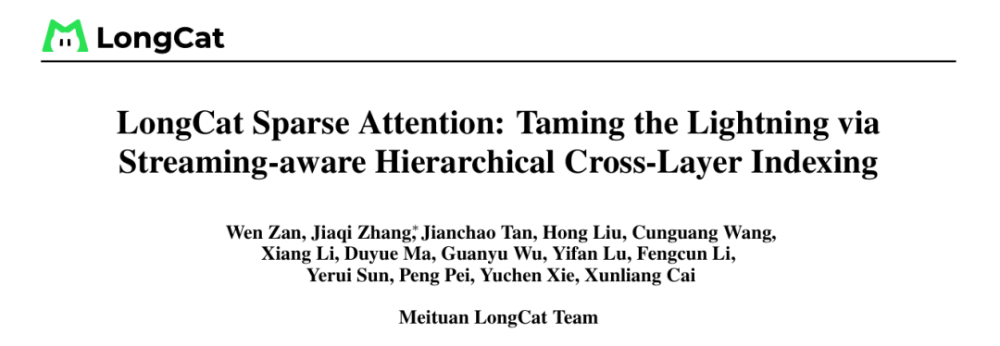  

  * 技术报告标题：LongCat Sparse Attention: Taming the Lightning via Streaming-aware Hierarchical Cross-Layer Indexing
  * huggingface链接：https://huggingface.co/meituan-longcat/LongCat-Flash-Lite-Sparse

  

 _**01**_

**三项设计优化**

**百万Token Attention   

LSA仍然延续了DSA的核心思路，通过索引器筛选重要Token，再对筛选后的 Token 进行稀疏 Attention 计算。

  

但针对百万Token场景下暴露出的访存效率和索引成本问题，LongCat团队提出了三个相互独立、可以自由组合的优化模块：

  

**（1）Streaming-Aware Indexing（SI）****（2）Cross-Layer Indexing（CLI）****（3）Hierarchical Indexing（HI）****  
**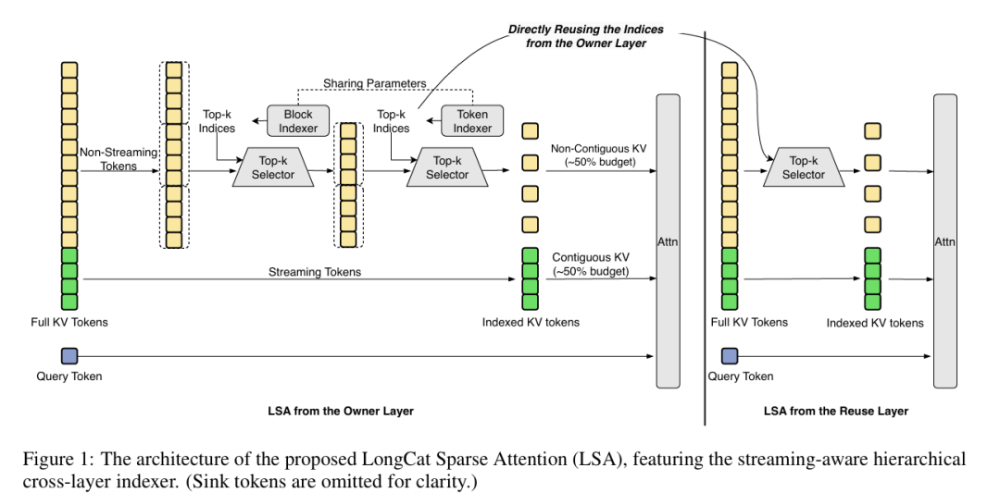图 1 LongCat Sparse Attention 整体架构  

###  （一）SI把一半预算固化成流

###   

StreamingLLM和DuoAttention的研究都指向同一个发现，Attention天然存在流式模式。

  

少量的初始token作为注意力sink吸收大量权重，加上局部滑动窗口就能维持稳定的perplexity。美团团队的实验进一步验证了这一点。

  

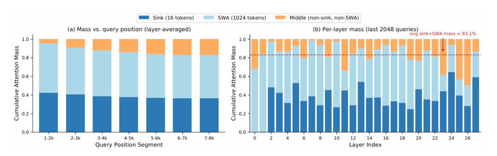

图2 sink 与滑动窗口的 attention mass分布

  

在LongCat-Flash-Lite上对20个InfBench-QA样本统计的注意力质量分布。Sink和 SWA平均捕获约83%的注意力质量。

  

基于这个发现，SI把稀疏注意力的预算一分为二，Ksink=16的固定sink区加Kswa=1024的滑动窗口加剩余K稀疏，总K=2048。

  

固定部分约占总预算的50%，以连续块形式驻留在HBM中，可以走coalesced读。动态部分继续由索引器选择。

  

这么一来，50%的预算直接走流式连续访问路径，HBM利用率大幅提升，索引器的打分范围也从L缩小到L−Ksink−Kswa。

  

在kernel层面，团队设计了Hybrid Sparse Attention（HFA）算子，把SFA和SWA放到两个非阻塞硬件流上并行执行，最后通过online-softmax rescaling合并结果。

  

### （二）CLI让相邻层共享同一个索引器

###   

另一个关键观察是，相邻Transformer层的显著token集合高度一致。团队在LongCat-Flash-Lite上做了详细测量。

  

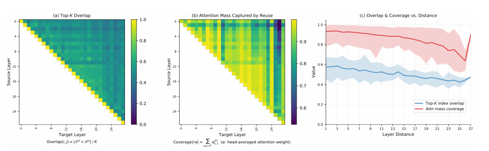

图 3 跨层 Top-K 重合度与 attention mass 覆盖度分析

  

在LongCat-Flash-Lite上对各层独立选取Top-K的分析。相邻层共享约57%的Top-K预算，但复用相邻层索引仍能保留93.2%的目标层注意力质量。那就让一个owner层的索引器为相邻的N−1个reuse层服务，把索引计算量直接砍到1/N。

  

但直接复用会掉点。团队为此提出跨层蒸馏损失，让owner层的索引器同时针对组内所有层的注意力分布做KL蒸馏。这样owner层被训练成为整组服务的选择器。

  

消融实验显示，N=2，即两个相邻层共享一个索引器时质量几乎无损，但N=4时在长上下文任务上出现明显掉点。

  

LongCat-Flash-Lite的shortcut-connected架构天然支持偶数分组，所以团队选了N=2作为默认值。

  

团队还把CLI扩展到Multi-Token Prediction（MTP）模块，3个MTP步骤共享一个索引器（N=3）。因为MTP输出是草稿，最终由主模型验证，质量微降可以接受。

  

### （三）HI做粗排加精排

###   

索引器在每一步要做两件事，打分和Top-K选择。Top-K排序在长上下文时是瓶颈，因为要用慢速的向量处理单元。

  

HI的思路是先粗排再精排。

  

**（1）块级粗筛 。把序列分成P=128的page，每page再拆成B=8的sub-block，预计算每个sub-block的key均值。然后用索引器query对每个page的子块均值做打分，选出Top-M=1024个page。****（2）token级精排 。只在被召回的M·P=128K个token上做标准的索引器打分和Top-K选择。  

总选择复杂度从O(L)降到了O(L/P + MP)。HI是完全training-free的，即插即用，只需在推理时启用。在1024K上下文时，HI的索引器加速比可达4.11倍。

  

但HI也有代价。两阶段设计本身有block均值维护、粗打分、候选收集的开销。所以团队设定只在≥256K时启用HI，短上下文时回退到flat LI。

  

 _**02**_

**Kernel到底快了多少  

###  （一）SI的kernel收益

###   

团队在训练和推理两种场景下对比了HFA和baseline SFA。

  

训练时HFA forward最高加速1.91×，backward最高1.73×；推理prefill core attention加速1.56–1.69×，decode加速1.11–1.26×。

  

表1 核心 attention 训练延迟（ms）

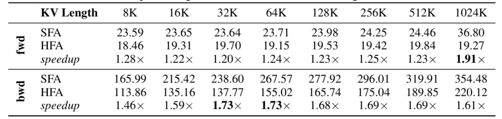  

表2 核心 attention 与 full-layer 推理延迟（ms）

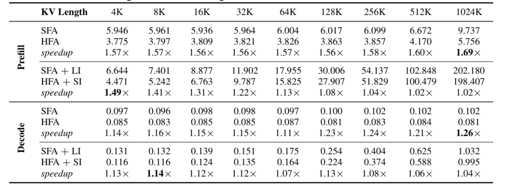

  

训练时HFA收益最明显，backward pass的scatter_add写冲突被SI的连续窗口部分显著缓解。

  

推理时core attention提速明显，但加上索引器开销后，全层加速在长上下文时收窄到1.02到1.04倍。SI主要解决短上下文瓶颈，CLI和HI才是长上下文的答案。

  

### （二）HI的kernel收益

###   

HI在32K到128K时反而变慢（0.79到0.82倍），粗筛的开销超过了精排的节省。只有256K之后HI才进入增长，1024K时达到4.11倍加速。

  

表3 延迟对比

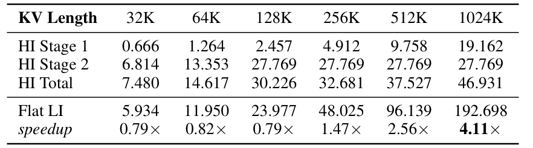

  

### （三）注意力层整体训练速度

###   

Forward加速1.42–1.92×，backward加速1.34–1.55×，总加速1.50–1.61×。

  

HI仅在推理时启用，训练收益完全来自SI+CLI。CLI只节省forward的索引器开销，SI在forward和backward都有效。

###   

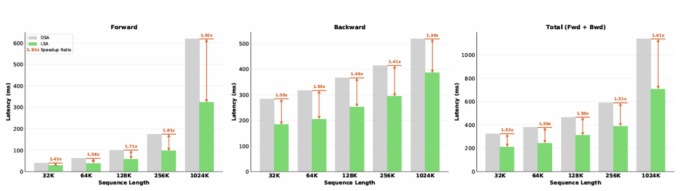

图 4 单层 attention 训练延迟对比

###   

 _**03**_

**69B到560B，**

**两种模型完成全面验证  

团队在LongCat-Flash-Lite和LongCat-Flash两个规模上验证了LSA，两个模型都采用shortcut-connected MoE架构与MLA注意力。

  

表4 实验使用的两个模型规模配置。

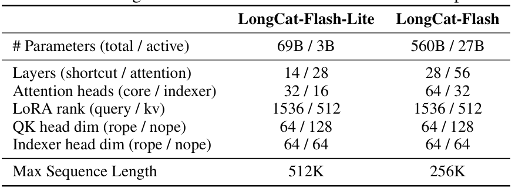

  

### （一）长上下文评估

###   

在LongCat-Flash-Lite上LSA基本追平甚至略超MLA和DSA。在560B规模上LSA甚至反超MLA，团队分析主要是因为LSA生成的推理链略短，减少了Re-rank类目中因max-length截断造成的失分。

  

表5 HELMET 长上下文评估  

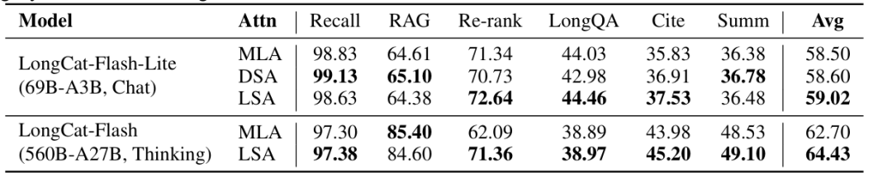

  

### （二）综合能力评估

###   

通用知识、数学推理、代码上LSA都和MLA打成了平手。

  

表6 通用知识、推理、代码 benchmark 评估

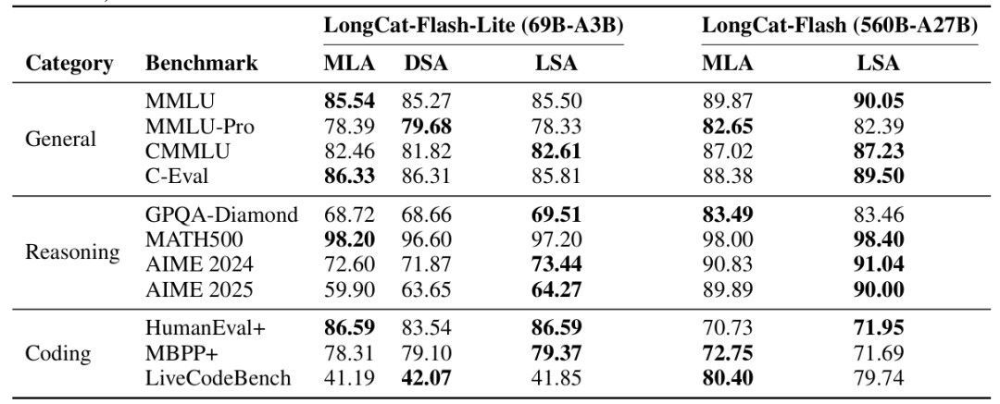

  

### （三）端到端推理加速

###   

prefill加速从4K的1.63倍一路扩大到1024K的3.60倍。decode在128K时达到峰值1.40倍，之后略有下降，因为≥256K时启用了KV-cache Partition，把KV分片到多rank，缩小了LSA的相对优势。

  

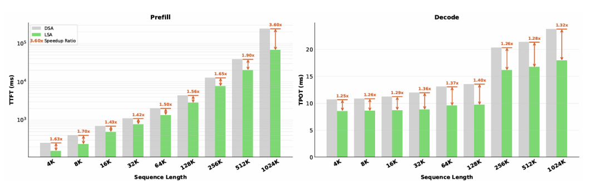

图 5 端到端推理延迟对比

  

### （四）跟dense MLA比训练效率

###   

这个对比更说明问题，在1024K上下文时，LSA的训练速度是dense MLA的7.73倍。LSA让百万token原生训练成为可能，靠的就是这个数字。

  

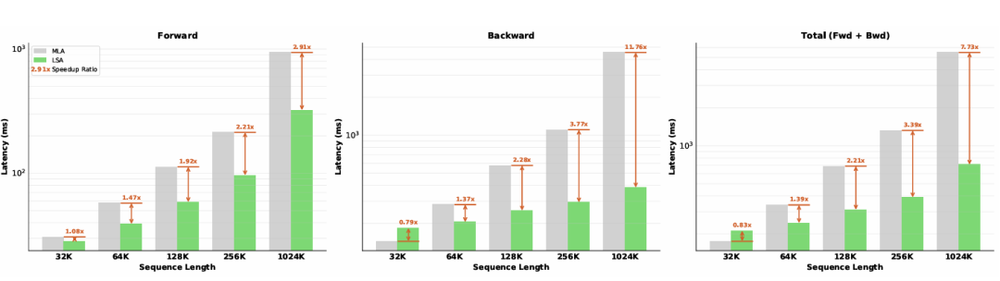

图6 LSA与dense MLA的单注意力层训练延迟对比。

  

### （五）MTP兼容性

###   

### 

CLI让3个MTP步骤共享一个索引器，acceptance length几乎不受影响。CLI可以无缝扩展到speculative decoding。

  

表7 3步MTP模块的mean acceptance length

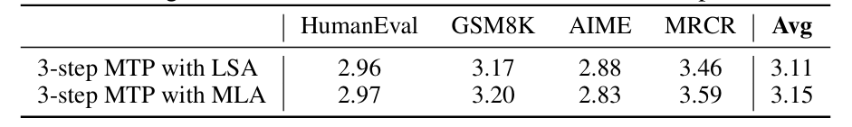

  

 _**04**_

**每个设计都不是白加的  

为了验证LSA各模块的实际贡献，团队针对每一项核心设计都进行了细致的消融实验，量化了不同配置下的性能边界与权衡空间。

首先，关于固定预算比例的取舍。固定预算比例从0%到100%。在75%以下训练损失差异可忽略；100%（纯窗口）损失显著上升。NIAH 128K任务上，50%固定质量持平或略超MLA。

综合来看，50%固定比例最大化硬件效率且不损失长上下文质量。

  

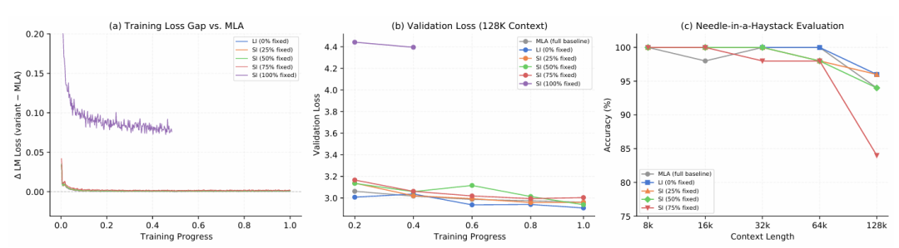图7 固定预算比例消融（最终取 50% 连续 KV）

  

表8 SI的HELMET chat评估。

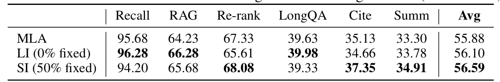

  

接下来考察跨层共享的深度边界。

  

N=2的训练损失差异<0.002，NIAH 128K上准确率与LI持平。但N=4在32K以上就开始明显掉点，且即使topk扩到4K也无法恢复。去掉跨层蒸馏后N=2的NIAH准确率从96%暴跌到70%。

  

由此可以判断，跨层蒸馏不是可选项。没有它，复用相邻层索引在128K NIAH任务上准确率从96%掉到70%，比蒸馏后的N=4还差。

  

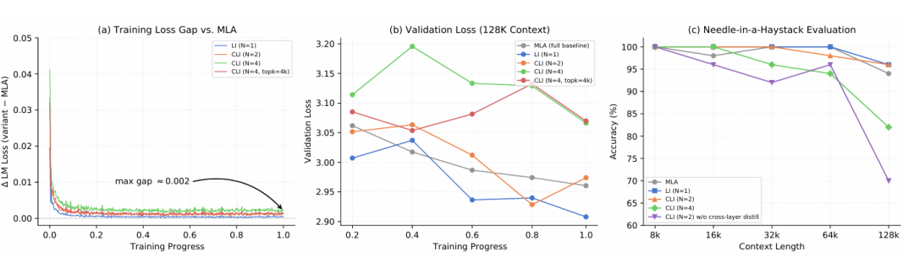

图8 跨层共享消融

  

表9 CLI的HELMET chat评估

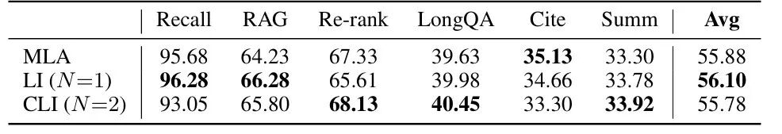

  

再看CLI在MTP模块上的泛化表现。MTP各步CLI复用后的Δ loss和Δ acc，差异均在零附近（mean Δ loss < 10⁻³，mean Δ acc < 0.1%）。

  

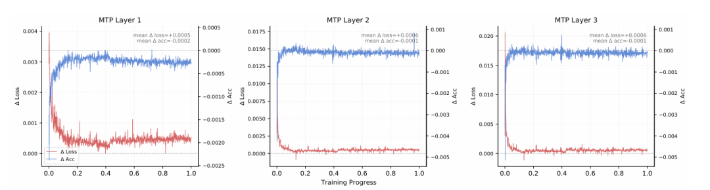

图9 3 步 MTP 的 loss 与 accuracy 差距

  

最后是转换时机的鲁棒性验证。128K早转换和512K晚转换两种策略的loss gap都<0.01（<0.5%绝对损失），SFT loss gap几乎为零。

  

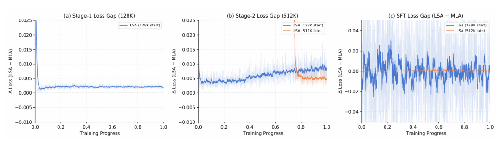

图10，从MLA转换到LSA的时机对比

  

 _**05**_

**LSA不是终点，**

**而是稀疏Attention的新起点  

LSA是稀疏注意力从能跑到好用的标志性进展。

  

SI用50%固定预算换硬件效率，CLI用跨层共享换索引开销减半，HI用两阶段选择换超长上下文下的索引速度。三个机制都是orthogonal的，可以单独使用，也可以任意组合。

  

稀疏注意力不是一锤子买卖，而是一个需要算法、硬件、训练策略协同设计的系统问题。DeepSeek的DSA迈出了第一步，但要把稀疏注意力真正落地到百万级token的训练和推理，还需要更多类似LSA这样的工程化创新。

  

LSA也有局限。它不减少KV cache的存储总量，只是降低了计算量。团队明确指出了未来方向，与Cross-Layer Attention和Compressed Sparse Attention等正交技术结合，实现既算得快又存得少的稀疏架构。

  

**END**

  

**关注+星标，获取AI前沿进展与优质开源项目**

