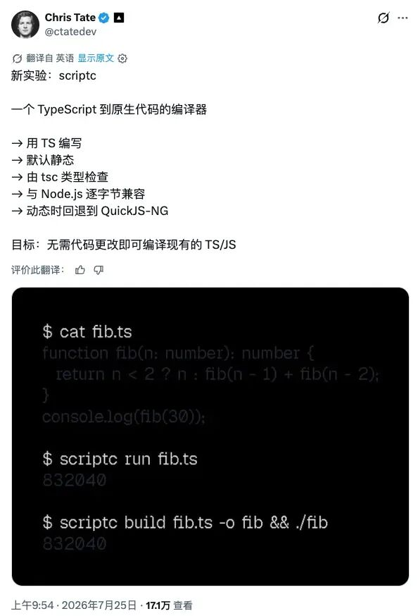
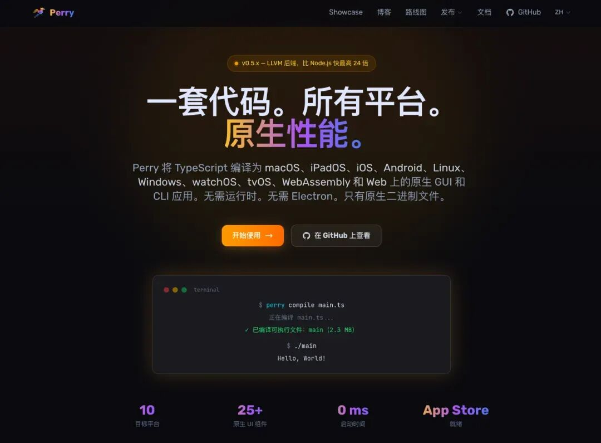
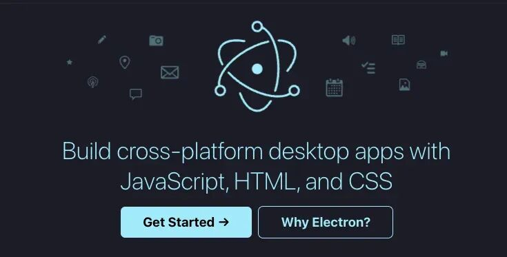
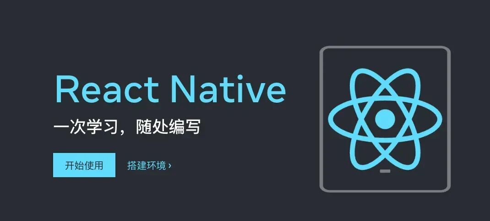
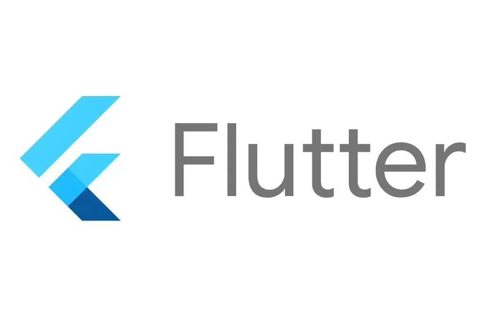
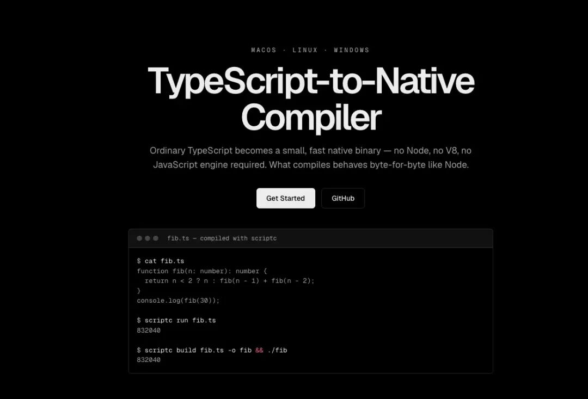
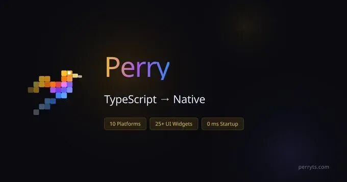

# 颠覆 RN、Flutter、Electron！TypeScript 一夜翻盘！

**作者**: 前端开发爱好者
**发布时间**: 2026-08-04 08:33
**原文链接**: https://mp.weixin.qq.com/s/FcQrVWgFvL3y4YSQMQ32mQ

---

前端圈最近有两个**开源项目** 突然火了。

一个是 **Vercel Labs** 开源：`scriptc`



另一个是社区项目：`Perry`



它们都在挑战一个问题：

**TypeScript 能不能直接生成原生程序？**

过去 **TypeScript** 一直依赖 `JavaScript Runtime`。

写完代码，需要经过浏览器、Node.js 或 Electron 才能运行。

但现在有人开始尝试：

让 **TypeScript** 直接变成 **Native** 。

# 跨平台开发，一直在寻找更优解

过去几年，跨平台开发主要有三个方向。

## Electron：开发效率拉满，但成本也高



**Electron** 最大的优势：

前端开发者可以直接用熟悉的技术栈开发桌面应用。

HTML、CSS、JavaScript 都能继续使用。

这也是为什么 VS Code、Discord 等应用选择它。

但问题同样明显：

  * Chromium 体积巨大
  * 内存占用高
  * 启动速度慢

很多时候，一个小工具背后运行的是一个完整浏览器。

## React Native：前端进入移动端

**React Native** 让 **JavaScript** 可以控制 **Native** 组件。



它解决了前端开发移动应用的问题。

但 JS 和 Native 之间存在通信成本。

项目越来越复杂后：

  * 性能优化
  * 原生能力扩展
  * 状态同步

都会成为新的挑战。

## Flutter：体验优秀，但自带体系

**Flutter** 通过自己的渲染引擎提供一致体验。



优点：

  * 性能稳定
  * UI 表现统一

但它并不是直接使用系统 UI，而是维护了一套 Flutter 生态。

之前的方案，本质都是：让 JavaScript 技术进入 Native 世界。

而 `Perry` 和 `scriptc` 想做的是：**让 TypeScript 本身进入 Native 世界。**

#  scriptc：Vercel 探索 TypeScript 原生编译

另一个火起来的项目：`vercel-labs/scriptc`



它的目标：**让 TypeScript 像 Rust、Go 一样直接编译。**

传统 Node 应用需要：

  * Node.js
  * npm 依赖
  * Runtime

而 scriptc 探索：

直接生成 Native Binary。

对于这些场景：

  * CLI 工具
  * Serverless
  * Edge Function
  * 自动化脚本

非常有吸引力。

以前发布一个工具，需要准备整个运行环境。

未来可能只需要：**一个二进制文件** 。

# Perry：用 TypeScript 写原生应用

`Perry` 的目标非常大胆：

**直接使用 TypeScript 开发 Native App。**



它希望最终生成真正的原生程序：

  * 不依赖 Node.js
  * 不需要浏览器环境
  * 可以直接运行

官方理念：

> No runtime. No Electron. Just native binaries.

简单来说：

以前开发一个应用，需要运行环境。

而 Perry 希望：编译完成后，直接得到一个程序。

这也是它和 Electron 最大的区别。

Electron 是：**“把 Web 放进桌面。”**

Perry 是：**“让 TypeScript 变成桌面应用。”**

#  如何快速体验？

## scriptc

安装：
```

npm install -g scriptc  

```

创建：
```

const message: string = "Hello scriptc";  
  
console.log(message);  

```

编译：
```

scriptc build hello.ts  

```

直接运行生成结果即可。

整体体验和 Go、Rust 类似：

写代码，然后得到二进制。

## Perry

安装：
```

npm install @perryts/perry  

```

创建：
```

console.log("Hello Perry");  

```

编译：
```

npx perry compile hello.ts -o hello  

```

运行：
```

./hello  

```

最终得到的是一个独立可执行文件。

# 它们和 Electron、RN、Flutter 有什么区别？

| 方案           | 核心思路                        |
|--------------|-----------------------------|
| Electron     | Web 技术打包桌面                  |
| React Native | JS 控制 Native                |
| Flutter      | 自带渲染体系                      |
| Perry        | TypeScript 生成 Native App    |
| scriptc      | TypeScript 编译 Native Binary |

最大的变化：

过去大家研究的是：

**如何让 JavaScript 跑在更多平台。**

现在开始探索：

**TypeScript 能不能直接成为更多平台的开发语言。**

#  写在最后

最近几年，JavaScript 生态变化非常明显。

`Oxc` 用 Rust 重写 JS 工具链。

`Rolldown` 探索下一代打包方案。

`Native SDK` 尝试连接 Web 与 Native。

`scriptc` 探索 TypeScript 原生编译。

它们背后其实都是同一个方向：

**JavaScript 生态正在补齐 Native 能力。**

当然，**Perry** 和 **scriptc** 目前还处于探索阶段。

如果 **TypeScript** 可以直接生成原生应用，未来前端开发的边界在哪里？

  * **Perry 官网** ：`https://www.perryts.com/zh-Hans/`
  * **scriptc 官网** ：`https://scriptc.dev/`
  * **Perry Github 地址** ：`https://github.com/PerryTS/perry`
  * **scriptc Github 地址** ：`https://github.com/vercel-labs/scriptc`


